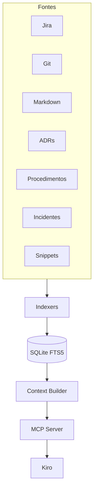

# Dev Context Engine (DCE)

**Motor de Contexto para Agentes de IA** — consolida conhecimento técnico corporativo e entrega pacotes de contexto estruturados para o [Kiro](https://kiro.dev) via MCP.

> O DCE **não** é uma base de conhecimento genérica.  
> O DCE **não** é um clone de ai-memory.  
> O produto central é o **Context Builder**.

---

## Status

| Item | Valor |
|------|--------|
| Versão | `1.14.0` (Sprint 30) |
| Fase | Pós-1.0 — **Sprint 30 concluída; aguardando aprovação para Sprint 31** |
| Licença | MIT |
| Stack | Python 3.12+, SQLite FTS5, Typer, Rich, PyYAML, Pydantic, MCP SDK |

**1.14.0:** + MCP `search_by_component` (PB-072).  
**1.13.0:** + MCP `search_by_project` (PB-071).  
**1.12.0–1.0.0:** Git cut-release, Windows Releases, Context Builder.  
Windows: [`docs/Windows.md`](docs/Windows.md) · Git: [`docs/ReleaseGit.md`](docs/ReleaseGit.md) · PyPI: `./scripts/publish.sh --upload`.

---

## Quick start

```bash
python3.12 -m venv .venv
source .venv/bin/activate
pip install -e ".[dev]"

dce init .
dce index .
dce build "ORA-12541"
dce mcp --path .
```

Instalação como pacote (quando publicado):

```bash
pip install dev-context-engine
dce --version
```

> Distribuição PyPI: **`dev-context-engine`** (o nome `dce` já estava ocupado).  
> Import e CLI continuam `dce`. Detalhes: [`docs/Packaging.md`](docs/Packaging.md).

### Fontes indexadas

| Indexer | Default | `source_type` | On by default? |
|---------|---------|---------------|----------------|
| markdown | docs / README | `markdown` | yes |
| adr | `docs/adr/**` | `adr` | yes |
| memory | `.dce/memory/**` | `memory` | yes |
| procedure | `.dce/procedures/**`, `procedures/**`, `docs/procedures/**` | `procedure` | yes |
| incident | `.dce/incidents/**`, `incidents/**`, `docs/incidents/**` | `incident` | yes |
| snippet | `.dce/snippets/**`, `snippets/**`, `docs/snippets/**` | `snippet` | yes |
| jira_import | `imports/jira/**` | `jira` | no |
| jira_rest | Jira REST JQL (env credentials) | `jira` | no |
| git | `git log` (max 200) | `git` | no |

```bash
dce index . --source git
dce hooks install .              # optional: post-commit reindex (git only)
dce index . --source jira_rest   # requires JIRA_* env; never required offline
dce build "PAY-7" --source-type git
```

Jira REST (opcional):

```bash
export JIRA_BASE_URL=https://your.atlassian.net
export JIRA_EMAIL=you@example.com
export JIRA_API_TOKEN=...          # or JIRA_PAT=...
# dce.yaml: indexers.jira_rest.enabled: true
dce index . --source jira_rest
```

Âncoras extras (opcional em `dce.yaml`):

```yaml
retrieval:
  anchors:
    extra_patterns:
      - name: err_code
        pattern: '\b(ERR-\d{4})\b'
        kind: error_code
        case: upper
```

### Kiro / MCP

Contrato normativo: [`docs/MCP.md`](docs/MCP.md) (`schema_version: "1"`).

```bash
dce init .
dce index .
dce mcp --path /absolute/path/to/workspace
```

Exemplo de registro MCP (Kiro / clientes compatíveis):

```json
{
  "mcpServers": {
    "dce": {
      "command": "dce",
      "args": ["mcp", "--path", "/absolute/path/to/workspace"]
    }
  }
}
```

Tools estáveis: `build_context` (primária), `search_context`, `search_memory`, `search_by_issue`, `search_by_project`, `search_by_component`, `get_document`, `recent_documents`.

Qualidade:

```bash
ruff check src tests && ruff format --check src tests
mypy
pytest
```

---

## Visão em uma frase

Quando o Kiro pergunta *“já tivemos algo parecido com ORA-12541?”*, o DCE monta automaticamente um **pacote de contexto** com bugs, issues, ADRs, procedimentos, commits e snippets relevantes — de forma **offline, rápida e estruturada**.

---

## Por que existe

Em empresas de software o conhecimento se espalha em Jira, Git, PRs, ADRs, Markdown, wikis e conversas. Em poucos meses ele se perde: investigações se repetem, incidentes voltam e decisões arquiteturais são esquecidas.

O DCE indexa essas fontes e **constrói contexto**, em vez de apenas “buscar texto”.

---

## Arquitetura (visão)



Detalhes: [`docs/Architecture.md`](docs/Architecture.md).

---

## Princípios de produto

1. **Context Builder primeiro** — busca é primitiva; o valor é o pacote consolidado.
2. **100% offline** — sem APIs pagas, sem embeddings externos, sem banco vetorial.
3. **Kiro-first** — MCP com respostas estruturadas; Cursor é só a ferramenta de construção.
4. **Indexers independentes** — baixo acoplamento; nenhuma fonte depende de outra.
5. **Simplicidade operacional** — um arquivo SQLite por workspace; CLI + MCP stdio.

---

## Documentação

| Documento | Conteúdo |
|-----------|----------|
| [MCP Contract](docs/MCP.md) | Contrato MCP schema_version 1 (Kiro) |
| [Packaging](docs/Packaging.md) | Build, smoke e publish PyPI |
| [Windows portable](docs/Windows.md) | `dce.exe` ZIP para Windows / Kiro |
| [Release Windows](docs/ReleaseWindows.md) | Tag `v*` → Release assets + SHA-256 |
| [Operations](docs/Operations.md) | Runbook operacional local |
| [SLOs](docs/SLOs.md) | Alvos de latência + `dce bench` |
| [Release 1.0 Checklist](docs/ReleaseChecklist-1.0.md) | Gates RC → `1.0.0` + PyPI |
| [Product Vision](docs/ProductVision.md) | Problema, escopo, anti-escopo, discovery |
| [Architecture](docs/Architecture.md) | Módulos, fluxos, interfaces |
| [Architecture Decisions](docs/ArchitectureDecisions.md) | Índice de ADRs |
| [Roadmap](docs/Roadmap.md) | Evolução por releases |
| [Product Backlog](docs/ProductBacklog.md) | Itens priorizados |
| [Sprint 01](docs/Sprint01.md) | Planejamento da primeira sprint |
| [Coding Standards](docs/CodingStandards.md) | Padrões de código |
| [Testing Strategy](docs/TestingStrategy.md) | Estratégia de testes |
| [Release Strategy](docs/ReleaseStrategy.md) | Releases e gates |
| [Versioning](docs/Versioning.md) | SemVer e política de breaking changes |
| [Glossary](docs/Glossary.md) | Termos do domínio |
| [CHANGELOG](CHANGELOG.md) | Histórico de mudanças |

---

## Consumidor principal: Kiro

O DCE será consultado continuamente durante o desenvolvimento no Kiro. Requisitos de experiência:

- Latência previsível (alvo MVP: p95 &lt; 500 ms para `build_context` em índice local típico)
- Respostas **estruturadas** (JSON / modelos Pydantic), não prosa
- Ferramentas MCP estáveis e versionadas
- Pacotes de contexto com **orçamento de tamanho** (evitar inundar o agente)

Ferramentas MCP **estáveis** (`schema_version: "1"` — ver [`docs/MCP.md`](docs/MCP.md)):

| Tool | Papel |
|------|--------|
| `build_context` | **Principal** — monta o pacote de contexto |
| `search_context` | Busca filtrada no índice |
| `search_memory` | Alias tipado — só notas `memory` |
| `search_by_issue` | Alias tipado — chave Jira-like (`PAY-123`) |
| `search_by_project` | Alias tipado — escopo por projeto |
| `search_by_component` | Alias tipado — escopo por componente |
| `get_document` | Documento completo por ID |
| `recent_documents` | Documentos recentes |

Demais aliases `search_by_*` (technology/tag) ficam fora do contrato até evidência de uso.

---

## Stack

- **Python 3.12+**
- **SQLite + FTS5** — índice full-text e metadados
- **Typer + Rich** — CLI
- **Pydantic + PyYAML** — modelos e configuração
- **MCP SDK oficial** (`mcp`) — servidor stdio
- **pytest + ruff + mypy** — qualidade

---

## Requisitos não negociáveis

- Offline completo
- Multiplataforma (macOS, Linux, Windows)
- Baixo uso de CPU/memória
- Sem banco vetorial
- Sem OpenAI / IA externa / APIs pagas

---

## Próximo passo

Sprint 30 encerrada. **Sprint 31 inicia somente após aprovação explícita.**

Para cortar/publicar release:

```bash
./scripts/cut_release.sh          # tag local v1.14.0
# configurar origin, depois:
git push -u origin HEAD && ./scripts/cut_release.sh --push
# Actions → Windows Portable → Release assets
```

Ver: [`docs/Sprint30.md`](docs/Sprint30.md) · [`docs/MCP.md`](docs/MCP.md) · [`docs/ReleaseGit.md`](docs/ReleaseGit.md).

---

## Licença

MIT — ver [`LICENSE`](LICENSE).
