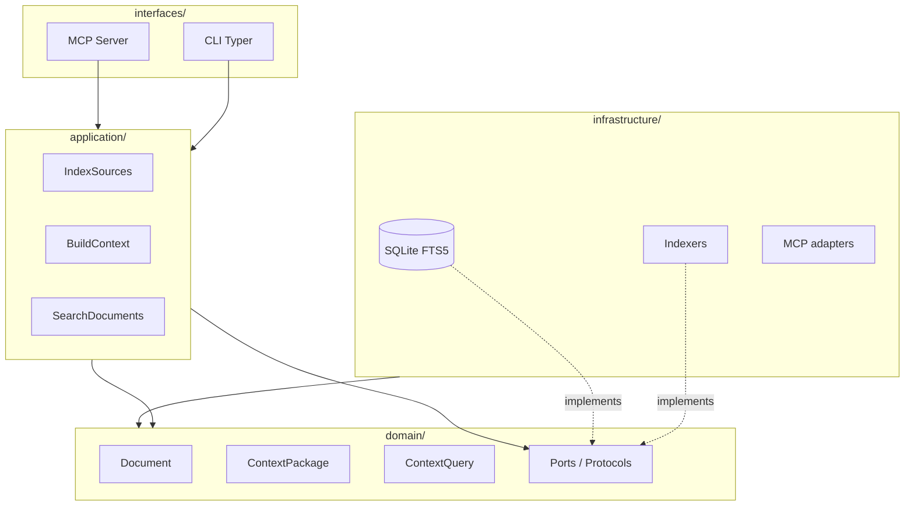
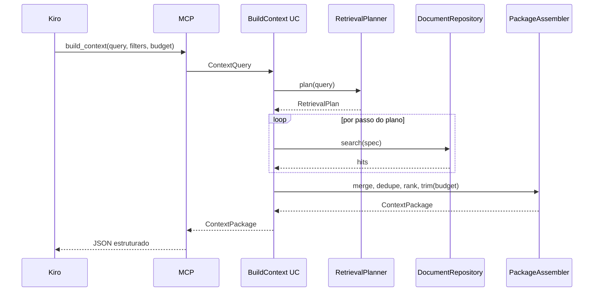
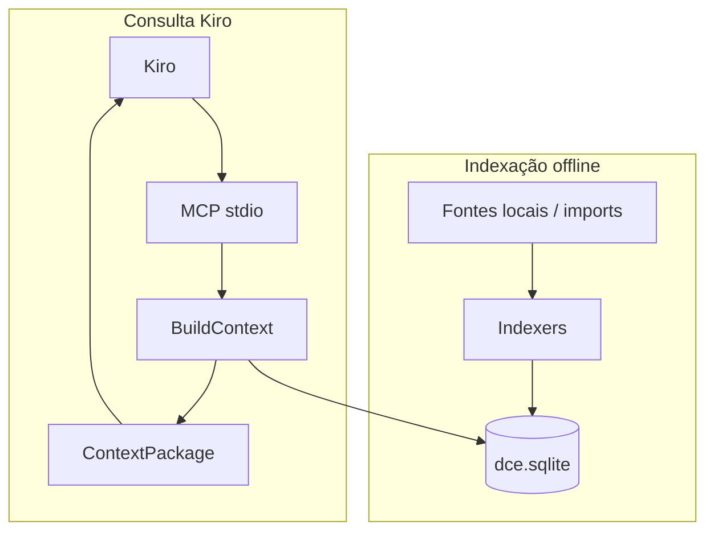

# Architecture — Dev Context Engine (DCE)

**Status:** Aceita · **Implementação:** Sprint 01 (store foundation) entregue  
**Última atualização:** 2026-07-29

---

## 1. Objetivos arquiteturais

| Objetivo | Como se manifesta |
|----------|-------------------|
| Simplicidade | Um DB SQLite; poucos processos; CLI + MCP |
| Baixo acoplamento | Indexers → Document; Builder não conhece Jira/Git |
| Extensibilidade | Novo indexer = nova implementação de porta |
| Desempenho | FTS5 + limites; sem rede na consulta |
| Manutenção | Clean Architecture leve; arquivos/classes pequenos |
| DX | Typer/Rich; erros claros; docs em `docs/` |
| Testabilidade | Portas + fakes; contract tests MCP |
| Kiro-first | Schemas estáveis; budget; latência previsível |

**Anti-objetivo:** overengineering (microserviços, event bus, plugin marketplace no dia 1).

---

## 2. Estilo arquitetural

Clean Architecture **pragmática** + Repository + DI simples (constructors / factory na composition root).



Dependências apontam **para dentro** (domain). Infrastructure implementa portas definidas no domain/application.

---

## 3. Mapa de módulos (planejado)

```text
src/dce/
  domain/           # entidades, value objects, ports
  application/      # use cases: index, build_context, search, get
  infrastructure/
    storage/        # SQLite schema, FTS, repositories
    indexers/       # markdown, jira_import, jira_rest, git, adr, memory, procedure, incident, snippet, ...
    mcp/            # serialização / tool wiring helpers
  interfaces/
    cli/            # Typer commands
    mcp/            # FastMCP server entry
```

| Camada | Responsabilidade | Não pode |
|--------|------------------|----------|
| `domain` | `Document`, `ContextPackage`, regras de budget, ports | Importar SQLite, Typer, FastMCP |
| `application` | Orquestrar casos de uso | Conhecer SQL ou HTTP Jira |
| `infrastructure` | Persistência, parsers, MCP wiring fino | Conter regra de negócio de ranking “escondida” sem teste |
| `interfaces` | Adaptar I/O humano/agente | Lógica de recuperação complexa |

---

## 4. Domínio canônico

### 4.1 Document

Unidade indexada única para todas as fontes.

| Campo | Descrição |
|-------|-----------|
| `id` | ID estável (hash de source+uri ou URI normalizada) |
| `source_type` | `markdown` \| `jira` \| `git` \| `adr` \| `snippet` \| `procedure` \| `incident` \| `memory` \| … |
| `uri` | Localizador (path, issue key, commit SHA, …) |
| `title` | Título |
| `body` | Texto indexável principal |
| `summary` | Resumo curto (opcional; pode ser primeiros N chars) |
| `metadata` | JSON tipado por fonte (sprint, labels, components, …) |
| `tags` | Lista normalizada |
| `project` / `component` / `technology` | Dimensões de filtro (opcionais, denormalizadas) |
| `created_at` / `updated_at` / `indexed_at` | Temporalidade |
| `related_uris` | Links canônicos: `issue:KEY`, `commit:SHA`, `pr:N` / HTTPS; paths bare; linker pós-index |

**Trade-off:** um modelo único vs hierarquia rica por fonte.  
**Decisão:** modelo único + `metadata` Pydantic por `source_type`. Evita explosão de tabelas; mantém tipagem na borda.

### 4.2 ContextQuery

Entrada do Builder:

- `text`: pergunta livre
- `anchors`: issue keys, error codes, paths detectados
- `filters`: project, component, technology, tags, source_types
- `budget`: max_documents, max_chars, max_per_source
- `mode`: `balanced` \| `precision` \| `recall` (v1 pode só `balanced`)

### 4.3 ContextPackage

Saída estruturada (MCP):

```text
ContextPackage
  query: ContextQuery (eco)
  generated_at: datetime
  sections: list[ContextSection]
  documents: list[RankedDocument]
  diagnostics: RetrievalDiagnostics  # timings, kind, steps, synonyms, truncamentos
```

`ContextSection` agrupa por papel (`similar_bugs`, `procedures`, `adrs`, …), não só por fonte bruta — o Builder decide o papel.

---

## 5. Portas (interfaces)

```text
DocumentRepository
  upsert_many(docs)
  get(id) -> Document | None
  search(SearchSpec) -> list[ScoredDocument]
  list_recent(limit, filters) -> list[Document]

Indexer(Protocol)
  name: str
  source_type: str
  discover(config) -> Iterable[RawItem]
  transform(item) -> Document

Clock / IdGenerator          # testabilidade
ContextBuilder               # application service
```

**Regra:** nenhum `Indexer` importa outro `Indexer`.

---

## 6. Storage — SQLite + FTS5

### 6.1 Decisão

Ver [ADR-001](adr/ADR-001.md). Um arquivo `dce.sqlite` (nome configurável) por workspace.

### 6.2 Esboço de schema (lógico)

```text
documents (
  id TEXT PK,
  source_type TEXT NOT NULL,
  uri TEXT NOT NULL UNIQUE,
  title TEXT,
  body TEXT,
  summary TEXT,
  metadata_json TEXT,
  project TEXT,
  component TEXT,
  technology TEXT,
  tags_json TEXT,
  related_uris_json TEXT,
  created_at TEXT,
  updated_at TEXT,
  indexed_at TEXT NOT NULL
)

documents_fts — FTS5 (title, body, summary, tags) content=documents / external content
index_runs — auditoria de indexação
schema_migrations — versão de schema
```

Índices B-tree em `source_type`, `project`, `component`, `updated_at` para filtros e `recent_documents`.

### 6.3 Busca

`SearchSpec` combina:

1. FTS5 MATCH (BM25)
2. Filtros SQL
3. Boosts: title hit, exact anchor (ORA-12541, PROJ-123), `source_type` preferido pelo plano

**Sem** extensão vetorial.

---

## 7. Context Builder (núcleo)

Ver [ADR-002](adr/ADR-002.md).



### 7.1 RetrievalPlanner

Analisa a query:

- Detecta âncoras (`[A-Z][A-Z0-9]+-\d+`, `ORA-\d+`, paths) + padrões extras em `retrieval.anchors`
- Escolhe `source_types` prioritários
- Define quotas (`max_per_source`)

Exemplos:

| Query | Plano (ilustrativo) |
|-------|---------------------|
| `ORA-12541` | incidents, jira, procedures, snippets, git |
| `por que usamos SQLite?` | adr, markdown, memory |
| `PROJ-4421` | jira (get), related git/PRs, procedures |

### 7.2 PackageAssembler

- Dedupe por `id` / `uri`
- Rank final = score FTS × boosts × freshness leve
- Trim por `ContextBudget`
- Preenche `sections` semânticas
- `diagnostics` sempre presentes (transparência para o Kiro/devtools)

### 7.3 Trade-off: planner estático vs ML

**v1:** regras + config YAML.  
**Depois:** pesos ajustáveis; ainda sem modelo externo.

---

## 8. Indexers


| Indexer | Entrada | Notas |
|---------|---------|-------|
| Markdown | Globs `**/*.md` | Frontmatter YAML opcional |
| ADR | `docs/adr/**` | Convenção Nygard / numeração |
| Jira API | REST | Pós-MVP; secrets via env |
| Jira Import | JSON/CSV | **Prioritário** para offline/firewall |
| Git | `git log`, diffs resumidos | Cuidado com volume — indexar mensagens + paths, não blob inteiro |
| Snippet | Dir configurável | |
| Procedure | Runbooks MD tipados | Pode ser especialização Markdown |
| Incident | Postmortems | Idem |
| Memory | Notas curadas locais | `source_type=memory` |

**Jira → Document estruturado** (campos alvo): número, título, descrição, tipo, prioridade, sprint, componentes, labels, responsável, comentários, solução, lições aprendidas (opcional/enrichment), arquivos relacionados, PRs relacionados.

---

## 9. MCP Server (Kiro)

Ver [ADR-003](adr/ADR-003.md).

- Transport: **stdio** (padrão para IDE agents)
- Framework: FastMCP ou SDK oficial (decidir na Sprint que introduzir MCP; preferir o que tiver schemas Pydantic limpos)
- Toda tool retorna **modelo Pydantic** serializado (estrutura), não string narrativa

### 9.1 Superfície de tools (alvo) vs MVP

| Tool | MVP | Notas |
|------|-----|-------|
| `build_context` | ✅ | Obrigatória |
| `search_context` | ✅ | Lista ranqueada |
| `get_document` | ✅ | |
| `recent_documents` | ✅ | |
| `search_by_issue` | ✅ | Alias tipado (`1.9.0`) — FTS por chave de issue |
| `search_by_project` | ⏳ | Preferir filtro em `search_context` |
| `search_by_component` | ⏳ | Idem |
| `search_by_technology` | ⏳ | Idem |
| `search_by_tag` | ⏳ | Idem |
| `search_memory` | ✅ | Alias tipado (`1.1.0`) — `source_type=memory` |

**Justificativa:** menos tools = menos carga cognitiva no Kiro e menos contratos para versionar. Aliases entram quando houver evidência de uso.

### 9.2 Contratos

- Contract tests com payloads golden
- Campo `schema_version` no pacote
- Breaking changes = major SemVer

---

## 10. CLI (secundária, essencial para operação)

Comandos planejados:

```text
dce init              # cria config + DB
dce index             # roda indexers configurados
dce index --source md
dce build "query"     # ContextPackage no stdout (JSON)
dce search "query"
dce show <id>
dce doctor            # FTS, schema, paths
dce mcp               # sobe servidor stdio
```

Rich para progress/tables; JSON via `--format json` para scripting.

---

## 11. Configuração

`dce.yaml` (exemplo conceitual):

```yaml
workspace:
  name: acme-platform
  database: .dce/dce.sqlite

budget:
  max_documents: 20
  max_chars: 24000
  max_per_source: 5

indexers:
  markdown:
    enabled: true
    paths: ["docs/**/*.md", "README.md"]
  adr:
    enabled: true
    paths: ["docs/adr/**/*.md"]
  procedure:
    enabled: true
    paths: [".dce/procedures/**/*.md", "procedures/**/*.md", "docs/procedures/**/*.md"]
  incident:
    enabled: true
    paths: [".dce/incidents/**/*.md", "incidents/**/*.md", "docs/incidents/**/*.md"]
  snippet:
    enabled: true
    paths: [".dce/snippets/**/*.md", "snippets/**/*.md", "docs/snippets/**/*.md"]
  jira_import:
    enabled: false
    path: imports/jira/*.json
  jira_rest:
    enabled: false
    jql: "order by updated DESC"
    max_results: 50
```

Sem rede obrigatória. Secrets (Jira API) só em env, nunca no YAML commitado.

---

## 12. DI e composition root

```text
interfaces/cli/main.py  ou  interfaces/mcp/server.py
  → build_container(config)
      → SqliteDocumentRepository
      → Indexer registry
      → ContextBuilder
      → use cases
```

Sem framework IoC. Função `build_container` testável.

---

## 13. Cross-cutting

| Concern | Abordagem |
|---------|-----------|
| Logging | `structlog` ou logging JSON stdlib — decidir na Sprint 1 (preferir stdlib no MVP se bastar) |
| Errors | Hierarquia pequena `DceError`; códigos estáveis para MCP |
| Observability | `diagnostics` no package + logs de timing |
| Segurança | DB local; sem telemetria; path traversal guard nos indexers |

---

## 14. SLOs (alvos iniciais)

| Operação | Ambiente | Alvo |
|----------|----------|------|
| `build_context` | índice ~10k docs, SSD | p95 &lt; 500 ms |
| `search_context` | idem | p95 &lt; 200 ms |
| `get_document` | idem | p95 &lt; 50 ms |
| `dce index` Markdown 1k files | cold | &lt; 30 s |

Registro normativo e medição: [`SLOs.md`](SLOs.md) (`dce bench`).  
Runbook: [`Operations.md`](Operations.md).

---

## 15. Fluxo end-to-end



---

## 16. Testabilidade

- Domain: unit puro
- Application: fakes de `DocumentRepository`
- Storage: testes SQLite em tmpfs/`tmp_path`
- MCP: contract tests (input → JSON schema)
- Indexers: fixtures de arquivos pequenos

Meta: **≥ 80%** cobertura nas camadas `domain` + `application` + `storage` core. Ver [`TestingStrategy.md`](TestingStrategy.md).

---

## 17. O que deliberadamente não teremos (agora)

- Message queue
- Microsserviços
- GraphQL
- Vector extension
- Daemon residente obrigatório (MCP sobe sob demanda pelo Kiro)
- Sharding

---

## 18. Evolução arquitetural

Ordem segura:

1. Domain + SQLite + Markdown indexer + BuildContext CLI  
2. MCP mínimo  
3. ADR + Memory  
4. Jira import JSON/CSV  
5. Git indexer conservador  
6. Planner mais rico + aliases MCP  
7. Jira API opcional  

Alinhado a [`Roadmap.md`](Roadmap.md).

---

## 19. Decisões registradas

Ver [`ArchitectureDecisions.md`](ArchitectureDecisions.md) e `docs/adr/`.
