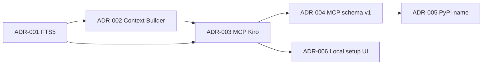

# Architecture Decision Records — Índice

Este documento indexa as decisões arquiteturais do DCE.  
Cada ADR vive em [`docs/adr/`](adr/) no formato proposto por Michael Nygard.

## Status legend

| Status | Significado |
|--------|-------------|
| Proposed | Em discussão |
| Accepted | Vigente |
| Deprecated | Substituída |
| Superseded | Substituída por outro ADR |

## Índice

| ADR | Título | Status | Data |
|-----|--------|--------|------|
| [ADR-001](adr/ADR-001.md) | SQLite FTS5 como único store de busca/indexação | Accepted | 2026-07-29 |
| [ADR-002](adr/ADR-002.md) | Context Builder como núcleo do produto | Accepted | 2026-07-29 |
| [ADR-003](adr/ADR-003.md) | Interface MCP-first otimizada para Kiro | Accepted | 2026-07-29 |
| [ADR-004](adr/ADR-004.md) | Estabilidade do contrato MCP schema_version 1 | Accepted | 2026-07-29 |
| [ADR-005](adr/ADR-005.md) | Nome de distribuição PyPI `dev-context-engine` | Accepted | 2026-07-29 |
| [ADR-006](adr/ADR-006.md) | UI local de setup (`dce ui`, localhost-only) | Accepted | 2026-07-30 |

## Quando criar um ADR

- Escolha de tecnologia com trade-off relevante
- Mudança de contrato público (MCP, schema, config)
- Alteração de fronteira entre módulos
- Rejeição explícita de alternativa popular (ex.: vector DB)

## Template mínimo

Contexto → Decisão → Alternativas → Consequências → Status.

## Diagrama de influência

