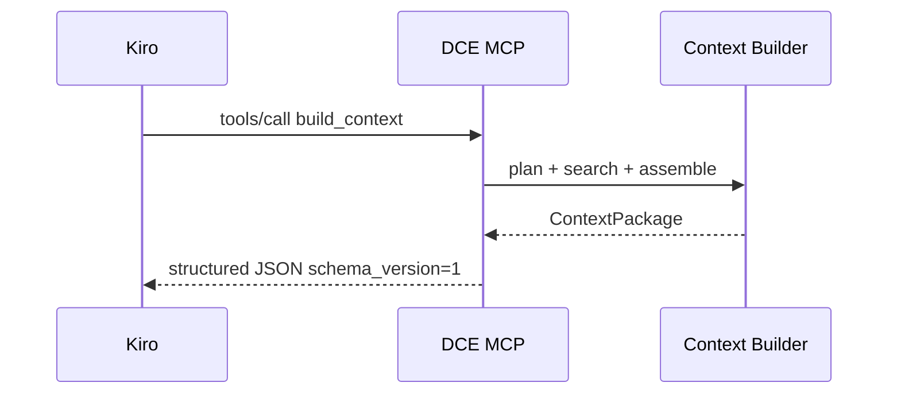

# MCP Contract — Dev Context Engine (Kiro)

**Status:** Normativo para `schema_version: "1"` (**estável em `1.0.0`**; tools aditivas em `1.1.0+`)  
**Release:** freeze desde `1.0.0rc1`; estável em `1.0.0`; aliases aditivos em `1.1.0+`
**ADR:** [ADR-004](adr/ADR-004.md)  
**Código:** `dce.interfaces.mcp.contract`

---

## Visão geral

O DCE expõe um servidor MCP **stdio** (`dce mcp --path <workspace>`).  
Respostas são **JSON estruturado** (Pydantic), nunca prosa livre.

Tool primária: **`build_context`**. As demais são primitivas de lookup.



---

## Tools estáveis (freeze)

| Tool | Papel | Retorno |
|------|--------|---------|
| `build_context` | Monta `ContextPackage` (preferir sempre) | `ContextPackage` |
| `search_context` | FTS rankeado | `{schema_version, documents[]}` |
| `search_memory` | Alias tipado: só `source_type=memory` | `{schema_version, documents[]}` |
| `search_by_issue` | Alias tipado: FTS por chave `PAY-123` | `{schema_version, documents[]}` |
| `search_by_project` | Alias tipado: escopo por slug de projeto | `{schema_version, documents[]}` |
| `search_by_component` | Alias tipado: escopo por slug de componente | `{schema_version, documents[]}` |
| `search_by_technology` | Alias tipado: escopo por slug de tecnologia | `{schema_version, documents[]}` |
| `search_by_tag` | Alias tipado: escopo por uma tag | `{schema_version, documents[]}` |
| `list_facets` | Valores distintos de project/component/technology/tag/source_type | `{schema_version, facets}` |
| `workspace_status` | Saúde do workspace (igual a `dce doctor --json`) | `{schema_version, healthy, checks[], mcp}` |
| `get_document` | Lookup por id | `{schema_version, found, document}` |
| `recent_documents` | Mais recentes + filtros | `{schema_version, documents[]}` |

`search_memory` entrou em **1.1.0**; `search_by_issue` em **1.9.0**; `search_by_project`–`search_by_tag` em **1.13–1.16**; `list_facets` em **1.20.0**; `workspace_status` em **1.21.0** (aditivos; `schema_version` permanece `"1"`).

### `build_context` — parâmetros

| Campo | Tipo | Obrigatório | Notas |
|-------|------|-------------|-------|
| `text` | string | sim | Pergunta / sintomas |
| `anchors` | string[] | não | Issue keys, ORA-*, paths |
| `project` / `component` / `technology` | string | não | Filtros |
| `tags` / `source_types` | string[] | não | Filtros; `source_types` sobrescreve preferred sources |
| `max_documents` / `max_chars` / `max_per_source` | int | não | Override do budget do `dce.yaml` |

### Diagnostics (aditivos em v1)

`ContextPackage.diagnostics` inclui:

- `elapsed_ms`, `hits_by_source`, `truncated`, `notes`
- `query_kind`, `preferred_sources`, `steps`, `synonym_expansions`

Campos novos só entram como **opcionais** sem bump de `schema_version`.

---

## Regras de compatibilidade

1. Adicionar campo opcional → ok (MINOR).
2. Adicionar tool → novo ADR + contract test + CHANGELOG (MINOR); preferir evidência.
3. Remover/renomear tool ou campo required → novo `schema_version` e/ou MAJOR.
4. `schema_version` no payload deve ser `"1"` enquanto este documento for vigente.

---

## Configuração no Kiro

Exemplo de entrada MCP (ajuste o caminho absoluto e o interpretador):

```json
{
  "mcpServers": {
    "dce": {
      "command": "dce",
      "args": ["mcp", "--path", "/absolute/path/to/workspace"]
    }
  }
}
```

Pré-requisitos no workspace:

```bash
dce init .
dce index .
dce doctor .
```

O processo MCP **não deve** escrever prosa em stdout (stdio é o canal do protocolo).

---

## Como o agente deve usar

1. Preferir `build_context` para perguntas de desenvolvimento.
2. Usar `search_context` só quando precisar de hits crus.
3. Usar `search_memory` para notas locais curadas (`.dce/memory`).
4. Usar `search_by_issue` para chaves Jira-like (`PAY-125`).
5. Usar `search_by_project` para restringir hits a um projeto (`payments` / `project:payments`).
6. Usar `search_by_component` para restringir hits a um componente (`listener` / `component:listener`).
7. Usar `search_by_technology` para restringir hits a uma tecnologia (`oracle` / `technology:oracle`).
8. Usar `search_by_tag` para restringir hits a uma tag (`oracle` / `tag:oracle`).
9. Usar `list_facets` para descobrir slugs válidos antes dos aliases `search_by_*`.
10. Usar `workspace_status` para checar saúde do índice antes de consultas pesadas.
11. Usar `get_document` / `recent_documents` para lookup pontual.
12. Respeitar `diagnostics.truncated` e o budget — o pacote já veio cortado de propósito.

---

## Testes de contrato

Ver `tests/contract/test_mcp_tools.py` — freeze de tools, `schema_version`, shapes e diagnostics.
