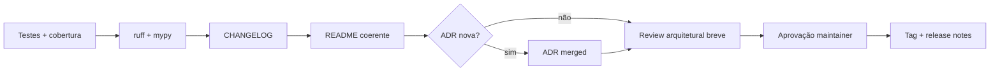

# Release Strategy — Dev Context Engine (DCE)

**Última atualização:** 2026-07-29

---

## 1. Objetivos

Releases **pequenas, reversíveis e auditáveis**, compatíveis com uso corporativo diário e com contratos MCP consumidos pelo Kiro.

---

## 2. Trem de releases

| Tipo | Quando | Exemplos |
|------|--------|----------|
| **Documentation** | Fases 1–5 / mudanças só em `docs/` | 0.0.x |
| **Sprint release interna** | Fim de sprint aprovada | tag `sprint-01` opcional |
| **Minor / patch públicos** | Funcionalidade ou fix | 0.1.0, 0.1.1 |
| **Major** | Breaking MCP/CLI/schema | 1.0.0, 2.0.0 |

Alinhamento SemVer: [`Versioning.md`](Versioning.md).

---

## 3. Gates obrigatórios (antes de tag)

1. CI verde (pytest, ruff, mypy)  
2. Cobertura core ≥ 80% (ou plano explícito se exceção temporária)  
3. `CHANGELOG.md` com entradas sob a versão  
4. README atualizado se UX mudou  
5. ADR se decisão arquitetural  
6. Aprovação humana do maintainer  
7. **Não** iniciar próxima sprint sem fechamento/aprovação da atual  

---

## 4. Artefatos por release

- Tag Git `vX.Y.Z`
- GitHub Release (quando remoto existir) com notas = CHANGELOG
- Pacote PyPI: distribuição `dev-context-engine` (ver [`Packaging.md`](Packaging.md)); upload gated pelo maintainer
- Checklist 1.0: [`ReleaseChecklist-1.0.md`](ReleaseChecklist-1.0.md)
- `schema_version` MCP documentado se tools mudarem

---

## 5. Hotfix

- Branch a partir da tag
- Patch SemVer
- Testes focados + regressão mínima
- Changelog sob `[X.Y.Z]`

Não misturar feature nova em hotfix.

---

## 6. Rollback

- Offline + arquivo SQLite: documentar se migration é reversível
- Migrations **forward-only** preferidas; breaking schema = major + guia de upgrade
- MCP breaking = major; Kiro deve pinna versão do servidor

---

## 7. Comunicação

- CHANGELOG é a fonte da verdade
- Breaking changes em seção própria + migração em `docs/` se necessário

---

## 8. O que não faz parte do release process

- Deploy cloud obrigatório
- Feature flags distribuídas complexas
- Canary multi-região (não há servidor central no MVP)

Operação = versão instalada localmente + DB do workspace.
