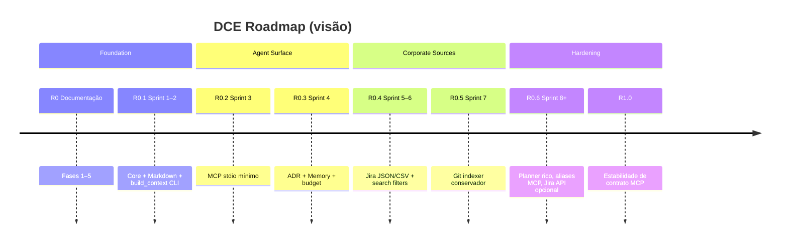
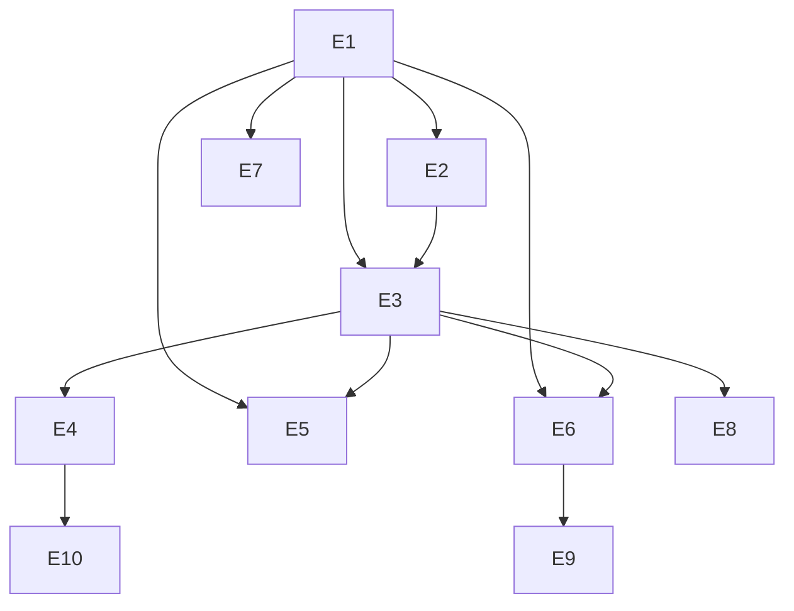

# Roadmap — Dev Context Engine (DCE)

**Horizonte:** 0 → 1.x em releases pequenas e revisáveis  
**Última atualização:** 2026-07-29

---

## Princípios do roadmap

1. **Uma fatia vertical por vez** — indexar → persistir → construir contexto → expor.
2. **Kiro-first** — MCP entra cedo, mas depois do core testável via CLI.
3. **Fontes por valor/risco** — Markdown/ADR antes de Jira API; import antes de rede.
4. **Nunca Sprint N+1 sem aprovação** do maintainer.
5. **Sem IA externa** em qualquer release planejada neste roadmap.

---

## Release train

| Release | Tema | Entrega principal | Fora |
|---------|------|-------------------|------|
| **0.0.x** | Docs only | Visão, arquitetura, backlog | Código de produto |
| **0.1.0** | Core offline | Schema SQLite/FTS5, Markdown indexer, `build_context` CLI, testes | MCP, Jira |
| **0.2.0** | MCP mínimo | `build_context`, `search_context`, `get_document`, `recent_documents` | Aliases `search_by_*` |
| **0.3.0** | Fontes estruturadas | ADR indexer, memory notes, budget diagnostics | Jira API |
| **0.4.0** | Jira offline | Import JSON/CSV → Document rico | Live REST |
| **0.5.0** | Git signal | Commits/mensagens/paths relacionados | Diffs gigantes / blame completo |
| **0.6.0** | Retrieval quality | Planner por âncoras, boosts, sinônimos técnicos | ML/embeddings |
| **1.0.0** | Contrato estável | MCP schema_version 1, docs de operação, SLOs medidos | Marketplace de plugins |
| **1.11.0** | Win release | ZIP + SHA-256 as GitHub Release assets on `v*` tags | Signed binary / MSI |
| **1.12.0** | Git release | Repo bootstrap + `cut_release.sh` SemVer tags | Push/remote + PyPI upload |
| **1.13.0** | MCP alias | `search_by_project` (additive schema_version 1) | `search_by_component/technology/tag` |
| **1.14.0** | MCP alias | `search_by_component` (additive schema_version 1) | `search_by_technology/tag` |
| **1.15.0** | MCP alias | `search_by_technology` (additive schema_version 1) | `search_by_tag` |
| **1.16.0** | MCP alias | `search_by_tag` — completes `search_by_*` set | Push/PyPI / signing |
| **1.17.0** | Adoption | Doctor MCP/index + Kiro guide + GitHub bootstrap | PyPI upload / signing |
| **1.18.0** | Release path | CI format green + Publish Trusted Publisher (OIDC) | First PyPI upload |
| **1.19.0** | First publish | Pending-publisher runbook + `doctor --json` + Actions Node 24 | Maintainer OIDC upload |
| **1.20.0** | Facets | MCP/CLI `list_facets` for discoverable `search_by_*` slugs | workspace_status / PyPI |
| **1.21.0** | Status | MCP `workspace_status` (= doctor --json) | index --json / PyPI |
| **1.22.0** | Ops JSON | `dce index --json` | — |
| **1.23.0** | Doctor stats | counts_by_source + newest_indexed_at | — |
| **1.24.0** | Tools CLI | `dce tools` | — |
| **1.25.0** | Recent CLI | `dce recent` | — |
| **1.26.0** | Docs | CONTRIBUTING + ProductVision hygiene | PyPI first upload |
| **1.27.0** | Setup UI | Localhost `dce ui` wizard for Kiro/Windows operators | Polish UX / Authenticode |

RC: `1.0.0rc1` (Sprint 15) — ver [`ReleaseChecklist-1.0.md`](ReleaseChecklist-1.0.md).

Datas são **ordenação**, não calendário fixo. Cada sprint ≈ uma pequena funcionalidade.

---

## Épicos

### E1 — Foundation Store
SQLite schema, migrations, FTS5, `DocumentRepository`, `dce init` / `doctor`.

### E2 — Markdown Indexer
Descoberta por glob, frontmatter, upsert incremental.

### E3 — Context Builder v1
`ContextQuery`, plano simples, assemble, budget, CLI `dce build`.

### E4 — MCP for Kiro
Servidor stdio, tools mínimas, contract tests, schemas Pydantic.

### E5 — ADR & Memory
Indexers + `source_type` dedicados; `search_memory` (✅ 1.1.0); Procedure/Incident/Snippet (✅ 1.3–1.5).

### E6 — Jira Import
JSON/CSV → documento estruturado (campos corporativos).

### E7 — Git Indexer
Histórico resumido; ligação `related_uris` (✅ 1.2.0).

### E8 — Retrieval Intelligence
Âncoras, quotas por fonte, dicionário de erros/tecnologias.

### E9 — Jira API (opcional)
REST atrás de flag; nunca obrigatório para consulta offline (✅ thin 1.6.0).

### E10 — Operação & Release
Versionamento, changelog discipline, packaging (PyPI), hooks opcionais (✅ post-commit 1.8.0).

---

## Dependências entre épicos

---

## MVP — critérios de aceite (produto)

Ver também [`ProductVision.md`](ProductVision.md).

- [ ] Indexação Markdown local funcional e idempotente
- [ ] `build_context` produz `ContextPackage` válido (JSON schema)
- [ ] Pacote respeita budget (não explode)
- [ ] Consulta 100% offline
- [ ] Testes automatizados nas camadas core com cobertura ≥ 80%
- [ ] Documentação de uso mínimo no README
- [ ] MCP mínimo disponível **no fechamento do MVP estendido (0.2.0)** — MVP estrito de engine pode ser 0.1.0 via CLI

**Nota de product:** o valor “para o Kiro” exige 0.2.0. O 0.1.0 valida o motor sem acoplar ao transport MCP.

---

## Plano de evolução (18 meses — orientação)

| Fase | Foco |
|------|------|
| 0–3 meses | 0.1 → 0.3: motor + MCP + ADR/memory |
| 3–6 meses | 0.4 → 0.5: Jira import + Git |
| 6–9 meses | 0.6: qualidade de retrieval; aliases MCP se necessário |
| 9–12 meses | 1.0: estabilidade de contrato; packaging; runbooks |
| 12–18 meses | Indexers adicionais (incident/procedure especializados), Jira API, performance em índices grandes |

---

## Explicitamente adiado

- UI web
- Sync multi-máquina
- Vector search
- Plugins distribuídos
- Multi-tenant server
- Integrações Slack/Teams como fonte primária

---

## Gates de avanço

Cada release exige:

1. Testes verdes + cobertura mínima nas áreas tocadas  
2. CHANGELOG atualizado  
3. README coerente  
4. ADR se decisão arquitetural nova  
5. Aprovação do maintainer para a **próxima** sprint  

Ver [`ReleaseStrategy.md`](ReleaseStrategy.md).
