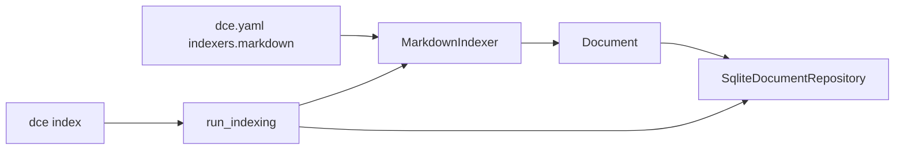

# Sprint 02 — Planejamento e entrega

**Sprint:** 02  
**Release alvo:** 0.1.0a2  
**Status:** 🟢 Concluída (aguardando aprovação de encerramento / Sprint 03)  
**Última atualização:** 2026-07-29

---

## Objetivo

Alimentar o store da Sprint 01 com documentos reais via **Markdown Indexer** e o comando **`dce index`**.

## Resultado

| ID | Item | Status |
|----|------|--------|
| PB-006 | Markdown Indexer | ✅ |
| PB-007 | `dce index` | ✅ |

**Qualidade:** 46 testes; cobertura ≈ **89%**; ruff + mypy limpos.

### Revisão arquitetural

- [x] Indexer isolado em `infrastructure/indexers/markdown.py` (sem acoplamento a outros indexers)
- [x] Use case `run_indexing` depende só de ports
- [x] Path traversal guard + skip de globs absolutos
- [x] Sem Context Builder / MCP (escopo respeitado)

---

## Escopo

| ID | Item | Critérios de aceite |
|----|------|---------------------|
| PB-006 | Markdown Indexer | Glob + frontmatter YAML; IDs estáveis; path traversal guard; upsert idempotente |
| PB-007 | `dce index` | Orquestra indexers habilitados; `--source` opcional; reporta contagens |

### Fora de escopo

- Context Builder / `dce build`
- MCP
- ADR indexer dedicado (arquivos ADR podem entrar como `markdown` se o glob cobrir)
- Jira / Git
- Skip incremental por hash (hash gravado em metadata para o futuro)

## Design

### Trade-offs

| Escolha | Motivo | Custo |
|---------|--------|-------|
| `source_type=markdown` também para ADRs sob `docs/**` | ADR indexer dedicado fica na Sprint futura | Sem seções ADR tipadas ainda |
| Upsert sempre (idempotente) | Simples e correto; FTS ressincroniza | Reescreve linhas mesmo sem mudança de conteúdo |
| markdown `enabled: true` no skeleton novo | DX: `init` + `index` funciona sem editar YAML | Workspaces antigos precisam habilitar manualmente |
| Sem dependência nova de glob/frontmatter | `pathlib` + PyYAML já presentes | Parser frontmatter mínimo próprio |

## Definition of Done

1. [x] Aceite PB-006 / PB-007  
2. [x] Testes + cobertura ≥ 80%  
3. [x] ruff + mypy  
4. [x] README + CHANGELOG  
5. [x] Maintainer aprova encerramento / Sprint 03  

## Sprint 03 (preview — não iniciar sem aprovação)

Candidata natural: **PB-008 Context Builder v1 + PB-009 `dce build` / `dce search` / `dce show`**.
