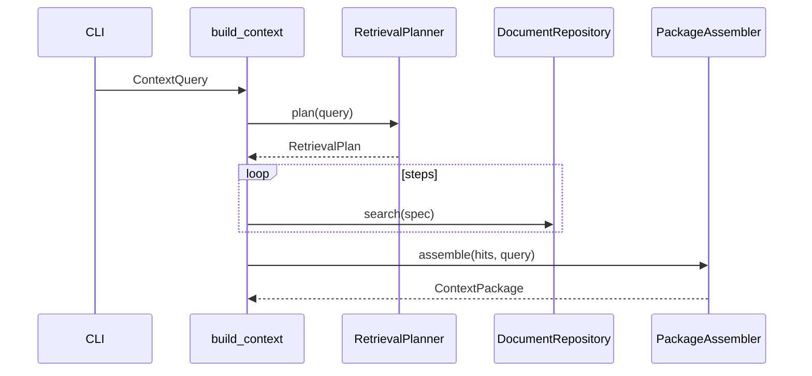

# Sprint 03 — Planejamento e entrega

**Sprint:** 03  
**Release alvo:** 0.1.0a3  
**Status:** 🟢 Concluída (aguardando aprovação de encerramento / Sprint 04)  
**Última atualização:** 2026-07-29

---

## Objetivo

Entregar o **núcleo do produto**: Context Builder v1 + CLI `build` / `search` / `show`.

## Resultado

| ID | Item | Status |
|----|------|--------|
| PB-008 | Context Builder v1 | ✅ |
| PB-009 | CLI `build` / `search` / `show` | ✅ |

**Qualidade:** 57 testes; cobertura ≈ **87%**; ruff + mypy limpos.

### Revisão arquitetural

- [x] Builder em `application/` depende só de `DocumentRepository` (port)
- [x] Planner/Assembler sem SQL / Typer
- [x] Budget aplicado via `apply_budget` de domínio
- [x] Sem MCP nesta sprint (escopo respeitado)

---

## Escopo

| ID | Item | Critérios de aceite |
|----|------|---------------------|
| PB-008 | Context Builder v1 | Planner por âncoras + busca FTS; assemble (dedupe/boost/budget/sections); `ContextPackage` |
| PB-009 | CLI build/search/show | Saída JSON estruturada; filtros básicos; usa budget do `dce.yaml` |

### Fora de escopo

- MCP (Sprint seguinte candidata)
- Retrieval ML / sinônimos avançados
- Aliases `search_by_*`
- ADR indexer dedicado

## Design

### Trade-offs

| Escolha | Motivo | Custo |
|---------|--------|-------|
| Planner v1 só regras/âncoras | Simples, testável, offline | Sem ranking semântico |
| Boost lexical por âncora no título/body | Melhora precision sem ML | Heurística |
| JSON default na CLI de consulta | Consumo por agentes / scripting | Tabela só com `--format table` |
| Seções por `source_type` | Sem taxonomia rica ainda | Nomes genéricos (`markdown`, …) |

## Definition of Done

1. [x] Aceite PB-008 / PB-009  
2. [x] Testes + cobertura ≥ 80%  
3. [x] ruff + mypy  
4. [x] README + CHANGELOG  
5. [x] Maintainer aprova encerramento / Sprint 04  

## Sprint 04 (preview — não iniciar sem aprovação)

Candidata natural: **PB-020…PB-025 MCP stdio** (`build_context`, `search_context`, `get_document`, `recent_documents`) + contract tests.
