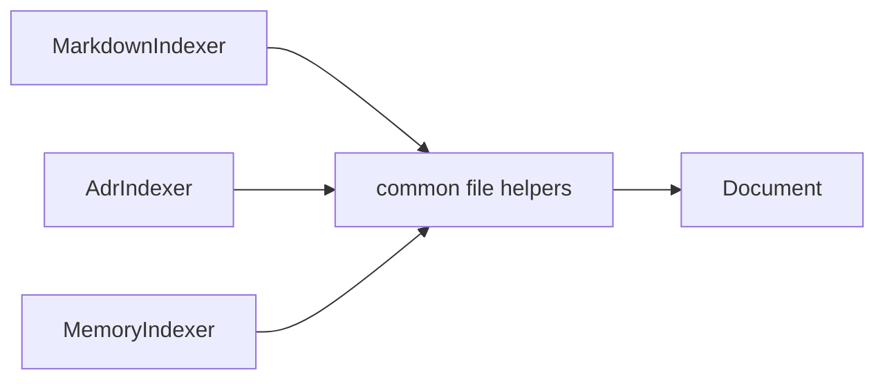

# Sprint 05 — Planejamento e entrega

**Sprint:** 05  
**Release alvo:** 0.3.0a1  
**Status:** 🟢 Concluída (aguardando aprovação de encerramento / Sprint 06)  
**Última atualização:** 2026-07-29

---

## Objetivo

Indexar **ADRs** e **notas de memória** como `source_type` dedicados, sem depender uns dos outros.

## Resultado

| ID | Item | Status |
|----|------|--------|
| PB-030 | ADR Indexer | ✅ |
| PB-031 | Memory Indexer | ✅ |

**Qualidade:** 69 testes; cobertura ≈ **87%**; ruff + mypy limpos.

### Revisão arquitetural

- [x] Nenhum indexer importa outro indexer
- [x] Helpers compartilhados em `common.py` (I/O), não herança cruzada
- [x] Markdown exclui paths de ADR/memory por padrão (sem duplicata)
- [x] Sem tool MCP `search_memory` (filtro `source_types` suficiente)

---

## Escopo

| ID | Item | Critérios de aceite |
|----|------|---------------------|
| PB-030 | ADR Indexer | Globs `docs/adr/**`; `source_type=adr`; metadados (número/status) |
| PB-031 | Memory Indexer | Notas locais (`.dce/memory/**`); `source_type=memory` |

### Fora de escopo

- `search_memory` MCP alias (PB-032 Could)
- Jira import
- Mudança de schema SQLite

## Design

### Trade-offs

| Escolha | Motivo | Custo |
|---------|--------|-------|
| Helpers comuns, não herança entre indexers | Evita acoplamento; DRY só no I/O de arquivo | Módulo `common.py` |
| Markdown exclui `docs/adr/**` por padrão | Evita duplicar ADR como markdown+adr | Workspaces antigos podem precisar ajustar YAML |
| Memory em `.dce/memory/` | Fica fora do glob genérico de docs | Convenção documentada |
| Sem tool MCP nova | Filtro `source_types=["memory"]` já cobre | Alias fica para depois |

## Definition of Done

1. [x] Aceite PB-030 / PB-031  
2. [x] Testes + cobertura ≥ 80%  
3. [x] ruff + mypy  
4. [x] README + CHANGELOG  
5. [x] Maintainer aprova encerramento / Sprint 06  

## Sprint 06 (preview — não iniciar sem aprovação)

Candidata natural: **PB-040 Jira Import JSON** (+ CSV se couber sem estourar o escopo).
