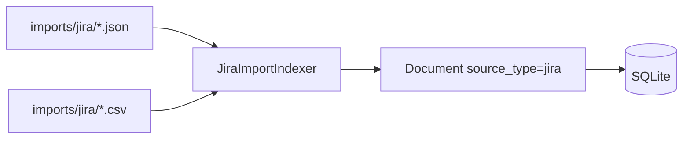

# Sprint 06 — Planejamento e entrega

**Sprint:** 06  
**Release alvo:** 0.4.0a1  
**Status:** 🟢 Concluída (aguardando aprovação de encerramento / Sprint 07)  
**Última atualização:** 2026-07-29

---

## Objetivo

Importar issues Jira **offline** via JSON (e CSV), gerando `Document` estruturado — sem API/rede.

## Resultado

| ID | Item | Status |
|----|------|--------|
| PB-040 | Jira Import JSON | ✅ |
| PB-041 | Jira Import CSV | ✅ |
| PB-042 | field_map solução/lições | ✅ |

**Qualidade:** 74 testes; cobertura ≈ **87%**; ruff + mypy limpos.

### Revisão arquitetural

- [x] Indexer isolado (`jira_import.py`); sem dependência de outros indexers
- [x] Sem rede / tokens
- [x] Opt-in (`enabled: false` por padrão)
- [x] Campos estruturados em `metadata` + body FTS-friendly

---

## Escopo

| ID | Item | Critérios de aceite |
|----|------|---------------------|
| PB-040 | Jira Import JSON | Lê exports locais; `source_type=jira`; campos ricos |
| PB-041 | Jira Import CSV | Mesmo mapeamento via `csv.DictReader` |
| PB-042 | field_map | Config YAML mapeia solution / lessons_learned |

### Fora de escopo

- Jira REST live (PB-080)
- Auth / tokens

## Design

### Trade-offs

| Escolha | Motivo | Custo |
|---------|--------|-------|
| Flat DCE + REST-ish | Exports reais e fixtures simples | Parser maior |
| Desabilitado por padrão | Imports são opt-in | Precisa `--source jira` ou `enabled: true` |
| JSON+CSV no mesmo indexer | Um source, dois formatos | OK |

## Definition of Done

1. [x] Aceite PB-040…042  
2. [x] Testes + cobertura ≥ 80%  
3. [x] ruff + mypy  
4. [x] README + CHANGELOG  
5. [x] Maintainer aprova encerramento / Sprint 07  

## Sprint 07 (preview — não iniciar sem aprovação)

Candidata natural: **PB-050 Git Indexer** (log + paths, volume limitado).
