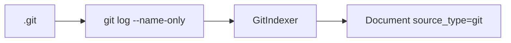

# Sprint 07 — Planejamento e entrega

**Sprint:** 07  
**Release alvo:** 0.5.0a1  
**Status:** 🟢 Concluída (aguardando aprovação de encerramento / Sprint 08)  
**Última atualização:** 2026-07-29

---

## Objetivo

Indexar **histórico Git de forma conservadora**: commits (mensagem + autores + paths), **sem** blobs/diffs completos.

## Resultado

| ID | Item | Status |
|----|------|--------|
| PB-050 | Git Indexer | ✅ |

**Qualidade:** 79 testes; cobertura ≈ **86%**; ruff + mypy limpos.

### Revisão arquitetural

- [x] Indexer isolado; usa `git` CLI (sem GitPython)
- [x] Sem diffs/blobs
- [x] `max_commits` limita volume
- [x] Opt-in (`enabled: false`)
- [x] Issue keys extraídas só como heurística leve (não fecha PB-051)

---

## Escopo

| ID | Item | Critérios de aceite |
|----|------|---------------------|
| PB-050 | Git Indexer | `git log` local; limite; `source_type=git`; paths em metadata |

### Fora de escopo

- Diffs / blame / blobs
- PB-051 ligação completa issue↔PR
- Hook post-commit
- Remotes / fetch

## Design

### Trade-offs

| Escolha | Motivo | Custo |
|---------|--------|-------|
| subprocess `git` | Sem dependência nova | Requer git no PATH |
| max 200 commits | Controla volume | Histórico antigo omitido |
| Sem diffs | Footprint baixo | Menos sinal linha-a-linha |
| Body em 2ª chamada log | Evita quebrar parser multilinha | 2 processos git |

## Definition of Done

1. [x] Aceite PB-050  
2. [x] Testes + cobertura ≥ 80%  
3. [x] ruff + mypy  
4. [x] README + CHANGELOG  
5. [x] Maintainer aprova encerramento / Sprint 08  

## Sprint 08 (preview — não iniciar sem aprovação)

Candidata natural: **PB-060/061 Retrieval quality** (planner por tipo de query + boosts) — épico E8.
