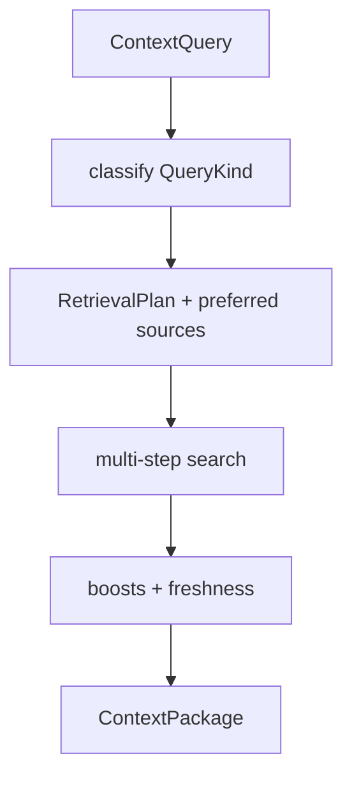

# Sprint 08 — Planejamento e entrega

**Sprint:** 08  
**Release alvo:** 0.6.0a1  
**Status:** 🟢 Concluída  
**Última atualização:** 2026-07-29

---

## Objetivo

Melhorar a qualidade do Context Builder: **planner por tipo de query** + **boosts** (title/anchor/tags/source/freshness).

## Resultado

| ID | Item | Status |
|----|------|--------|
| PB-060 | Planner por tipo | ✅ |
| PB-061 | Boosts title/anchor/freshness | ✅ |

**Qualidade:** 84 testes; cobertura ≈ **87%**; ruff + mypy limpos.

### Revisão arquitetural

- [x] Planner ainda rules-only (sem ML)
- [x] Filtros do usuário têm precedência sobre preferred sources
- [x] Boosts no assembler, não no SQLite
- [x] Seções semânticas por `query_kind`
- [x] PB-062 sinônimos fora de escopo

---

## Escopo

| ID | Item | Critérios de aceite |
|----|------|---------------------|
| PB-060 | Planner por tipo | Classifica query; passos por fontes preferidas |
| PB-061 | Boosts | Title/anchor/tags + preferred source + freshness |

### Fora de escopo

- PB-062 sinônimos FTS
- ML / embeddings
- Dicionário configurável externo (PB-034)

## Design

### Trade-offs

| Escolha | Motivo | Custo |
|---------|--------|-------|
| Regras built-in | Simples/testável | Menos custom por workspace |
| Preferred steps extras | Precision | Mais queries FTS (limitadas) |
| Freshness ≤ +2 | Não domina âncoras | Antigos ainda competem |

## Definition of Done

1. [x] Aceite PB-060 / PB-061  
2. [x] Testes + cobertura ≥ 80%  
3. [x] ruff + mypy  
4. [x] README + CHANGELOG  
5. [x] Maintainer aprova encerramento / Sprint 09  

## Sprint 09

Entregue em `0.7.0a1` — ver [`Sprint09.md`](Sprint09.md).
