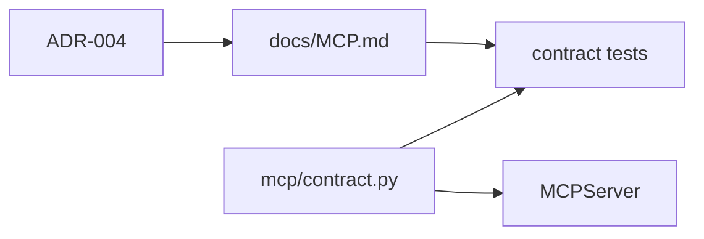

# Sprint 10 — Planejamento e entrega

**Sprint:** 10  
**Release alvo:** 0.8.0a1  
**Status:** 🟢 Concluída  
**Última atualização:** 2026-07-29

---

## Objetivo

Endurecer o **contrato MCP** consumido pelo Kiro: documentação operacional, freeze das 4 tools, contract tests ricos e política explícita de compatibilidade para `schema_version: "1"`.

## Resultado

| ID | Item | Status |
|----|------|--------|
| PB-025 | Contract tests MCP | ✅ |
| PB-026 | `schema_version` | ✅ |
| PB-027 | Doc integração Kiro | ✅ |

### Revisão arquitetural

- [x] Freeze das 4 tools em `mcp/contract.py`
- [x] ADR-004 + `docs/MCP.md` normativos
- [x] Diagnostics keys cobertos por contract tests
- [x] Sem claim de SemVer `1.0.0` (ainda faltam PyPI/SLOs)

---

## Escopo

| ID | Item | Critérios de aceite |
|----|------|---------------------|
| PB-025 | Contract tests MCP | Tools congeladas; shapes + diagnostics assertados |
| PB-026 | `schema_version` | Constante única; presente em todas as respostas tipadas |
| PB-027 | Doc integração Kiro | `docs/MCP.md` + exemplo de config no README |

### Fora de escopo

- Claim de `1.0.0` (SLOs / packaging completo)
- Tools `search_by_*`
- PB-090 PyPI publish
- PB-034 âncoras configuráveis

## Design

### Trade-offs

| Escolha | Motivo | Custo |
|---------|--------|-------|
| Hardening em 0.8.x (não 1.0) | Contrato documentado sem prometer SLO/PyPI | 1.0 ainda gated |
| Freeze das 4 tools | Menos carga cognitiva no Kiro | Aliases adiados |
| Constante `MCP_SCHEMA_VERSION` | Uma fonte de verdade | Touch em schemas |

## Definition of Done

1. [x] Aceite PB-025 / PB-026 / PB-027  
2. [x] Testes + cobertura ≥ 80%  
3. [x] ruff + mypy  
4. [x] README + CHANGELOG + ADR-004  
5. [x] Maintainer aprova encerramento / Sprint 11  

## Sprint 11

Entregue em `0.9.0a1` — ver [`Sprint11.md`](Sprint11.md).
