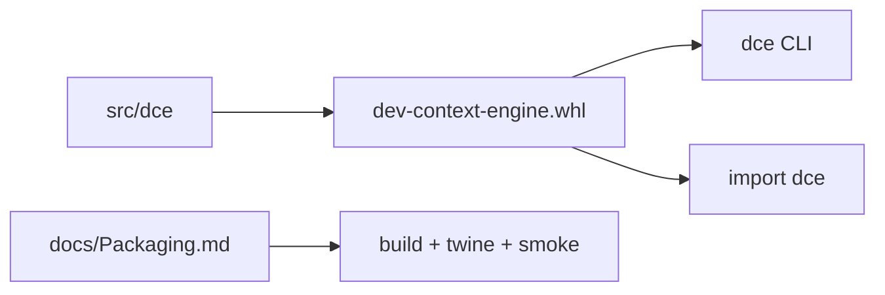

# Sprint 11 — Planejamento e entrega

**Sprint:** 11  
**Release alvo:** 0.9.0a1  
**Status:** 🟢 Concluída  
**Última atualização:** 2026-07-29

---

## Objetivo

Tornar o DCE **publicável** (PB-090): metadata PyPI correta, wheel/sdist válidos, smoke de instalação e docs de release — sem upload obrigatório nesta sprint.

## Resultado

| ID | Item | Status |
|----|------|--------|
| PB-090 | Empacotamento PyPI | ✅ (`dev-context-engine`) |

### Revisão arquitetural

- [x] Nome dist ≠ import documentado (ADR-005)
- [x] Hatch `force-include` removido — wheel builda
- [x] CI: build + twine + smoke
- [x] Upload PyPI permanece manual

---

## Escopo

| ID | Item | Critérios de aceite |
|----|------|---------------------|
| PB-090 | Empacotamento PyPI | `python -m build` + `twine check` verdes; wheel instala `dce` CLI |

### Descoberta crítica

O nome PyPI `dce` **já está ocupado** (placeholder BSO).  
Distribuição: **`dev-context-engine`**. Import e CLI permanecem `dce`.

### Fora de escopo

- Upload real ao PyPI (requer credenciais do maintainer)
- Claim SemVer `1.0.0`
- PB-034 âncoras configuráveis

## Design

### Trade-offs

| Escolha | Motivo | Custo |
|---------|--------|-------|
| Nome dist ≠ import | `dce` indisponível no PyPI | `pip install` usa nome longo |
| Não publicar ainda | Gate humano + token | Pacote ready, não live |
| Remover `force-include` hatch | Corrige wheel duplicado | Layout hatch canônico |

## Definition of Done

1. [x] Aceite PB-090  
2. [x] Testes + cobertura ≥ 80%  
3. [x] ruff + mypy  
4. [x] README + CHANGELOG + ADR-005 + Packaging.md  
5. [x] Maintainer aprova encerramento / Sprint 12  

## Sprint 12

Entregue em `0.10.0a1` — ver [`Sprint12.md`](Sprint12.md).
