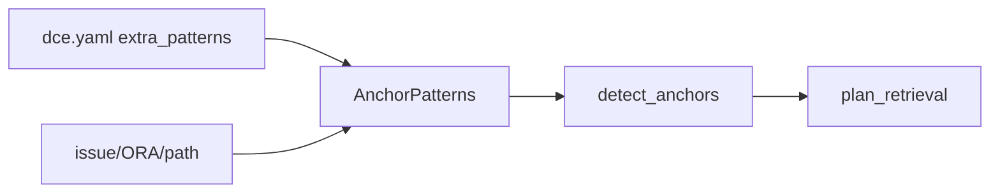

# Sprint 12 — Planejamento e entrega

**Sprint:** 12  
**Release alvo:** 0.10.0a1  
**Status:** 🟢 Concluída  
**Última atualização:** 2026-07-29

---

## Objetivo

Fechar PB-034: **dicionário de âncoras configurável** via `dce.yaml`, mantendo builtins (issue / ORA / path) e permitindo padrões extras por workspace.

## Resultado

| ID | Item | Status |
|----|------|--------|
| PB-034 | Âncoras configuráveis | ✅ |

### Revisão arquitetural

- [x] Built-ins preservados (issue / ora / path)
- [x] `extra_patterns` merge/replace por `name`
- [x] `kind` alimenta QueryKind
- [x] Regex inválida é ignorada (fail-soft)
- [x] CLI + MCP leem config

---

## Escopo

| ID | Item | Critérios de aceite |
|----|------|---------------------|
| PB-034 | Âncoras configuráveis | Built-ins + `retrieval.anchors.extra_patterns`; classificação por `kind` |

### Fora de escopo

- Desligar builtins individualmente (exceto replace por `name`)
- ML / embeddings
- PB-091 SLOs
- Claim `1.0.0`

## Design

### Trade-offs

| Escolha | Motivo | Custo |
|---------|--------|-------|
| Regex Python em YAML | Flexível para ERR-/HTTP/etc. | Workspace pode quebrar regex inválida |
| Merge additivo (extras) | Seguro / simples | Replace só por `name` |
| `kind` tipado | Classificação QueryKind correta | Patterns mal tipados → GENERAL |

## Definition of Done

1. [x] Aceite PB-034  
2. [x] Testes + cobertura ≥ 80%  
3. [x] ruff + mypy  
4. [x] README + CHANGELOG  
5. [x] Maintainer aprova encerramento / Sprint 13  

## Sprint 13

Entregue em `0.11.0a1` — ver [`Sprint13.md`](Sprint13.md).
