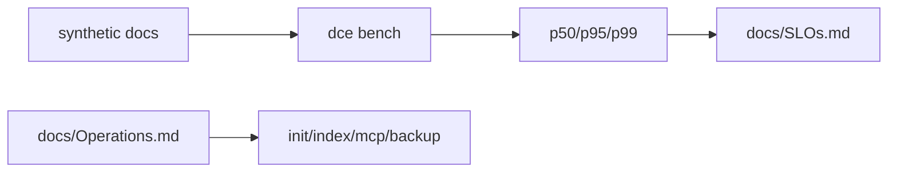

# Sprint 13 — Planejamento e entrega

**Sprint:** 13  
**Release alvo:** 0.11.0a1  
**Status:** 🟢 Concluída  
**Última atualização:** 2026-07-29

---

## Objetivo

Entregar **PB-091** (benchmarks + registro de SLOs) e um **runbook operacional** mínimo — preparando o caminho para `1.0.0-rc` sem claim prematuro de 1.0.

## Resultado

| ID | Item | Status |
|----|------|--------|
| PB-091 | Benchmarks + SLOs | ✅ (`dce bench`, `docs/SLOs.md`) |
| Ops | Runbook | ✅ (`docs/Operations.md`) |

### Revisão arquitetural

- [x] Corpus sintético explícito (direcional)
- [x] `within_slo` informativo — sem hard-fail CI
- [x] Alvos alinhados a Architecture §14
- [x] Sem claim SemVer 1.0

---

## Escopo

| ID | Item | Critérios de aceite |
|----|------|---------------------|
| PB-091 | Benchmarks + SLOs | `dce bench` mede p50/p95; `docs/SLOs.md` registra alvos |
| Ops | Runbook | `docs/Operations.md` com ciclo diário + recovery |

### Fora de escopo

- Claim SemVer `1.0.0` / `1.0.0rc1`
- Upload PyPI
- Hard-fail de SLO no CI (máquinas variam)

## Design

### Trade-offs

| Escolha | Motivo | Custo |
|---------|--------|-------|
| Bench sintético local | Reprodutível / offline | Não espelha 10k docs reais |
| SLO soft no CI | Evita flakiness | Gate humano no release |
| Sem 1.0 ainda | Falta publish + evidência de campo | Mais uma sprint até rc |

## Definition of Done

1. [x] Aceite PB-091 + runbook  
2. [x] Testes + cobertura ≥ 80%  
3. [x] ruff + mypy  
4. [x] README + CHANGELOG  
5. [x] Maintainer aprova encerramento / Sprint 14  

## Sprint 14

Entregue em `0.12.0a1` — ver [`Sprint14.md`](Sprint14.md).
