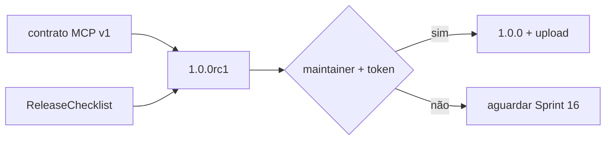

# Sprint 15 — Planejamento e entrega

**Sprint:** 15  
**Release alvo:** 1.0.0rc1  
**Status:** 🟢 Concluída  
**Última atualização:** 2026-07-29

---

## Objetivo

Congelar o **Release Candidate 1.0.0rc1**: contrato MCP `schema_version: "1"`, checklist de release, metadata PyPI em Beta, e documentação de caminho até `1.0.0` final — **sem upload PyPI** (requer token do maintainer).

## Resultado

| Item | Status |
|------|--------|
| Version `1.0.0rc1` | ✅ |
| `docs/ReleaseChecklist-1.0.md` | ✅ |
| Freeze docs (MCP / Versioning / Packaging) | ✅ |
| Classifier Beta | ✅ |

### Revisão arquitetural

- [x] Sem features novas no RC (freeze)
- [x] Contrato MCP v1 inalterado
- [x] Upload PyPI permanece gated
- [x] Checklist explícito para `1.0.0` final

---

## Escopo

| Item | Critérios de aceite |
|------|---------------------|
| Version `1.0.0rc1` | pyproject + `__version__` + CHANGELOG |
| Checklist 1.0 | `docs/ReleaseChecklist-1.0.md` |
| Freeze docs | Versioning / MCP / Packaging alinhados ao RC |

### Fora de escopo

- Upload PyPI / TestPyPI (credenciais)
- Tag Git (maintainer)
- Features novas (Jira REST, `search_by_*`)
- `1.0.0` final

## Design

### Trade-offs

| Escolha | Motivo | Custo |
|---------|--------|-------|
| RC antes de PyPI live | Valida pacote sem credenciais | Nome ainda não “oficial” no índice |
| Sem features novas | Freeze limpo | Débito Jira REST / aliases permanece |
| Classifier Beta | Honestidade SemVer RC | Marketing menos “Production” |

## Definition of Done

1. [x] Aceite freeze `1.0.0rc1`  
2. [x] Testes + cobertura ≥ 80%  
3. [x] ruff + mypy + build/twine  
4. [x] README + CHANGELOG + checklist  
5. [x] Maintainer aprova encerramento / Sprint 16  

## Sprint 16

Entregue em `1.0.0` — ver [`Sprint16.md`](Sprint16.md).
