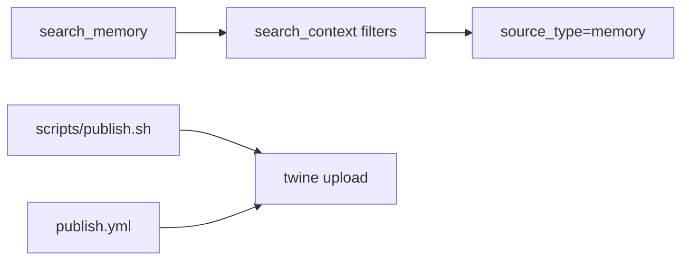

# Sprint 17 — Planejamento e entrega

**Sprint:** 17  
**Release alvo:** 1.1.0  
**Status:** ✅ Concluída (aguardando aprovação para Sprint 18)  
**Última atualização:** 2026-07-29

---

## Objetivo

Pós-1.0: entregar **PB-032 `search_memory`** (alias MCP tipado) + **automação de publish** (script + workflow manual) — upload real continua gated a token.

## Escopo

| ID | Item | Critérios de aceite | Status |
|----|------|---------------------|--------|
| PB-032 | `search_memory` | Tool MCP; filtra `source_type=memory`; contract test | ✅ |
| Ops | Publish automation | `scripts/publish.sh` + workflow `workflow_dispatch` | ✅ |

### Fora de escopo

- Upload PyPI sem token
- Aliases `search_by_*` gerais
- Jira REST

## Design

### Trade-offs

| Escolha | Motivo | Custo |
|---------|--------|-------|
| Alias fino só memory | Evidência: indexer memory existe | 5ª tool no contrato |
| schema_version permanece 1 | Aditivo (ADR-004) | Doc de tools atualizada |
| Publish manual/dispatch | Sem token no CI ainda | Maintainer aciona |

## Entregas

| Item | Detalhe |
|------|---------|
| Version `1.1.0` | pyproject + `__version__` + CHANGELOG |
| MCP `search_memory` | Alias tipado; `STABLE_TOOLS` + contract test |
| Publish | `scripts/publish.sh`, `.github/workflows/publish.yml` |
| Docs | MCP.md, ADR-004, Packaging, Architecture, Roadmap |

## Definition of Done

1. [x] Aceite `1.1.0` local  
2. [x] Testes + cobertura ≥ 80% + ruff/mypy  
3. [x] Contract MCP inclui `search_memory`  
4. [x] README + CHANGELOG + ProductBacklog  
5. [x] Maintainer aprova encerramento / Sprint 18  

## Sprint 18

Entregue em `1.2.0` — ver [`Sprint18.md`](Sprint18.md).
