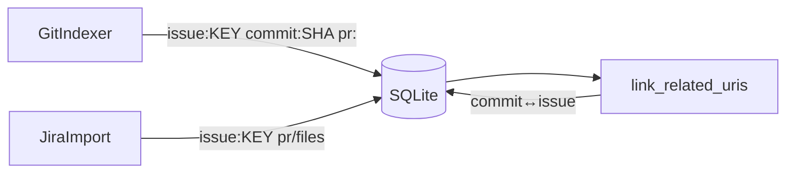

# Sprint 18 — Planejamento e entrega

**Sprint:** 18  
**Release alvo:** 1.2.0  
**Status:** ✅ Concluída (aguardando aprovação para Sprint 19)  
**Última atualização:** 2026-07-29

---

## Objetivo

Fechar **PB-051**: normalizar e **ligar** `related_uris` entre issues Jira, commits Git e PRs — sem Jira REST, sem aliases MCP genéricos.

## Escopo

| ID | Item | Critérios de aceite | Status |
|----|------|---------------------|--------|
| PB-051 | `related_uris` issue↔PR↔commit | URIs canônicas; linker pós-index; testes | ✅ |

### Fora de escopo

- Upload PyPI / tags git (gated a token + `.git`)
- Jira REST (PB-080)
- Aliases `search_by_*` (sem evidência de uso)
- Diffs / blame / remotes

## Design

### Trade-offs

| Escolha | Motivo | Custo |
|---------|--------|-------|
| Prefixos canônicos | Lookup estável no Kiro | Paths de arquivo ficam bare (compat) |
| Linker pós-`dce index` | Não acopla indexers entre si | Limite 500 docs/fonte por pass |
| Extrair PRs de mensagem | Fecha “↔PR” sem API | Heurística; URLs explícitas preferidas |

## Entregas

| Item | Detalhe |
|------|---------|
| Version `1.2.0` | pyproject + `__version__` + CHANGELOG |
| `related_uris` helpers | `issue:` / `commit:` / `pr:` + extract |
| Linker | `link_related_uris` após upserts em `run_indexing` |
| Indexers | Git + Jira emitem URIs canônicas |

## Definition of Done

1. [x] Aceite PB-051  
2. [x] Testes + cobertura ≥ 80% + ruff/mypy  
3. [x] README + CHANGELOG + ProductBacklog  
4. [x] Maintainer aprova encerramento / Sprint 19  

## Sprint 19

Entregue em `1.3.0` — ver [`Sprint19.md`](Sprint19.md).
