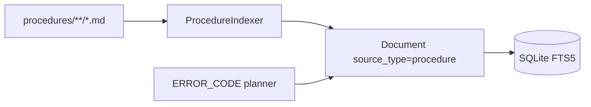

# Sprint 19 — Planejamento e entrega

**Sprint:** 19  
**Release alvo:** 1.3.0  
**Status:** ✅ Concluída (aguardando aprovação para Sprint 20)  
**Última atualização:** 2026-07-29

---

## Objetivo

Entregar **PB-081 Procedure Indexer**: markdown tipado com `source_type=procedure`, alinhado ao planner/assembler (ERROR_CODE → procedures).

## Escopo

| ID | Item | Critérios de aceite | Status |
|----|------|---------------------|--------|
| PB-081 | Procedure Indexer | Paths dedicados; `source_type=procedure`; exclusão markdown; testes | ✅ |

### Fora de escopo

- Incident / Snippet indexers (PB-082/083)
- Jira REST (PB-080)
- Publish PyPI / tags

## Design

### Trade-offs

| Escolha | Motivo | Custo |
|---------|--------|-------|
| Markdown tipado (não DSL) | Reusa common/frontmatter | Convenção de paths |
| Enabled by default | Planner já espera procedures | Mais paths no `dce index` |
| Sem Incident nesta sprint | Thin slice | PB-082 fica para depois |

## Entregas

| Item | Detalhe |
|------|---------|
| Version `1.3.0` | pyproject + `__version__` + CHANGELOG |
| `ProcedureIndexer` | steps/severity/audience metadata |
| Workspace | `.dce/procedures/` no `init`; markdown exclude |

## Definition of Done

1. [x] Aceite PB-081  
2. [x] Testes + cobertura ≥ 80% + ruff/mypy  
3. [x] README + CHANGELOG + ProductBacklog  
4. [x] Maintainer aprova encerramento / Sprint 20  

## Sprint 20

Entregue em `1.4.0` — ver [`Sprint20.md`](Sprint20.md).
