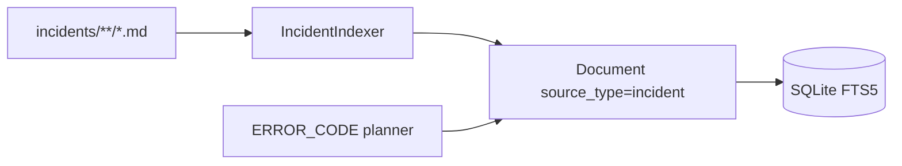

# Sprint 20 — Planejamento e entrega

**Sprint:** 20  
**Release alvo:** 1.4.0  
**Status:** ✅ Concluída (aguardando aprovação para Sprint 21)  
**Última atualização:** 2026-07-29

---

## Objetivo

Entregar **PB-082 Incident Indexer**: markdown tipado com `source_type=incident`, alinhado ao planner (ERROR_CODE → incidents).

## Escopo

| ID | Item | Critérios de aceite | Status |
|----|------|---------------------|--------|
| PB-082 | Incident Indexer | Paths dedicados; `source_type=incident`; exclusão markdown; testes | ✅ |

### Fora de escopo

- Snippet indexer (PB-083)
- Jira REST (PB-080)
- Publish PyPI / tags

## Design

### Trade-offs

| Escolha | Motivo | Custo |
|---------|--------|-------|
| Mirror do Procedure | Consistência tipada | Pouco código novo |
| Metadata resolution/impact | Valor para Kiro em incidentes | Convenção frontmatter |
| Sem Snippet nesta sprint | Thin slice | PB-083 depois |

## Entregas

| Item | Detalhe |
|------|---------|
| Version `1.4.0` | pyproject + `__version__` + CHANGELOG |
| `IncidentIndexer` | severity/status/resolution/error_codes |
| Workspace | `.dce/incidents/` no `init`; markdown exclude |
| Planner | ISSUE inclui `incident` nas preferred sources |

## Definition of Done

1. [x] Aceite PB-082  
2. [x] Testes + cobertura ≥ 80% + ruff/mypy  
3. [x] README + CHANGELOG + ProductBacklog  
4. [x] Maintainer aprova encerramento / Sprint 21  

## Sprint 21

Entregue em `1.5.0` — ver [`Sprint21.md`](Sprint21.md).
