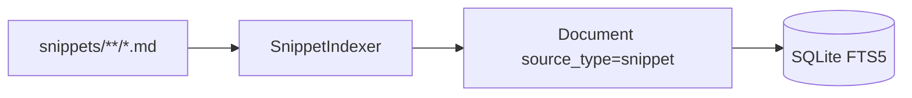

# Sprint 21 — Planejamento e entrega

**Sprint:** 21  
**Release alvo:** 1.5.0  
**Status:** ✅ Concluída (aguardando aprovação para Sprint 22)  
**Última atualização:** 2026-07-29

---

## Objetivo

Entregar **PB-083 Snippet Indexer**: markdown tipado com `source_type=snippet` para trechos de código / comandos curados.

## Escopo

| ID | Item | Critérios de aceite | Status |
|----|------|---------------------|--------|
| PB-083 | Snippet Indexer | Paths dedicados; language/código; exclusão markdown; testes | ✅ |

### Fora de escopo

- Jira REST (PB-080)
- Publish PyPI / tags
- Aliases MCP genéricos

## Design

### Trade-offs

| Escolha | Motivo | Custo |
|---------|--------|-------|
| Extrair 1ª fence de código | Útil sem DSL | Heurística |
| Enabled by default | Fecha E5 tipados | Mais paths no index |

## Entregas

| Item | Detalhe |
|------|---------|
| Version `1.5.0` | pyproject + `__version__` + CHANGELOG |
| `SnippetIndexer` | language/code/usage; fence extract |
| Workspace | `.dce/snippets/` no `init`; markdown exclude |
| Planner | ERROR_CODE + PATH preferem `snippet` |

## Definition of Done

1. [x] Aceite PB-083  
2. [x] Testes + cobertura ≥ 80% + ruff/mypy  
3. [x] Docs + CHANGELOG  
4. [x] Maintainer aprova encerramento / Sprint 22  

## Sprint 22

Entregue em `1.6.0` — ver [`Sprint22.md`](Sprint22.md).
