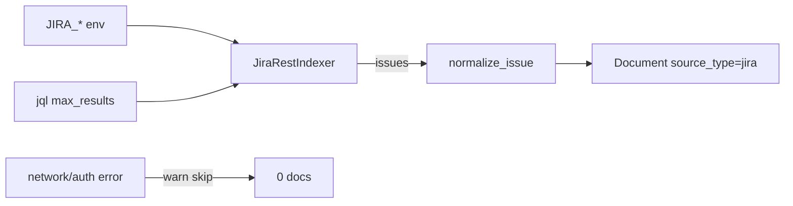

# Sprint 22 — Planejamento e entrega

**Sprint:** 22  
**Release alvo:** 1.6.0  
**Status:** ✅ Concluída (aguardando aprovação para Sprint 23)  
**Última atualização:** 2026-07-29

---

## Objetivo

Entregar **fatia PB-080**: indexer **Jira REST** opcional (search/JQL), credenciais só via env, **nunca bloqueia** o modo offline.

## Escopo

| ID | Item | Critérios de aceite | Status |
|----|------|---------------------|--------|
| PB-080 | Jira REST (thin) | Opt-in; JQL; `source_type=jira`; skip on failure; testes mock | ✅ |

### Fora de escopo

- Write-back / webhooks / sync contínuo
- Campos custom avançados além do `normalize_issue` existente
- Publish PyPI / tags

## Design

### Trade-offs

| Escolha | Motivo | Custo |
|---------|--------|-------|
| stdlib `urllib` | Sem nova dependência | Menos ergonomia que httpx |
| Credenciais só env | Secrets fora do YAML | Setup manual |
| Reuso `normalize_issue` / transform import | Um modelo de Document | Acoplamento leve a jira_import |

## Entregas

| Item | Detalhe |
|------|---------|
| Version `1.6.0` | pyproject + `__version__` + CHANGELOG |
| `JiraRestIndexer` | `/rest/api/2/search` + Basic/Bearer |
| Config | `jira_rest` disabled by default |

## Definition of Done

1. [x] Aceite fatia PB-080  
2. [x] Testes + cobertura ≥ 80% + ruff/mypy  
3. [x] Docs + CHANGELOG  
4. [x] Maintainer aprova encerramento / Sprint 23  

## Sprint 23

Entregue em `1.7.0` — ver [`Sprint23.md`](Sprint23.md).
