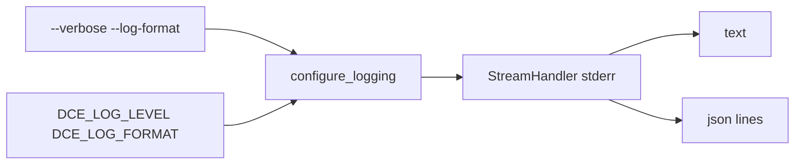

# Sprint 23 — Planejamento e entrega

**Sprint:** 23  
**Release alvo:** 1.7.0  
**Status:** ✅ Concluída (aguardando aprovação para Sprint 24)  
**Última atualização:** 2026-07-29

---

## Objetivo

Entregar **PB-012**: logging estruturado mínimo (stdlib) + flags CLI; MCP sempre loga em **stderr**.

## Escopo

| ID | Item | Critérios de aceite | Status |
|----|------|---------------------|--------|
| PB-012 | Logging estruturado | JSON/text; `--verbose` / `--log-format`; stderr; testes | ✅ |
| PB-011 | CI | Marcar ✅ (workflow já existia) | ✅ |

### Fora de escopo

- structlog / OpenTelemetry
- Publish PyPI / tags

## Design

### Trade-offs

| Escolha | Motivo | Custo |
|---------|--------|-------|
| stdlib only | Sem dependência nova | Sem structlog processors |
| stderr always | MCP stdio intacto | Rich continua em stdout |

## Entregas

| Item | Detalhe |
|------|---------|
| Version `1.7.0` | pyproject + `__version__` + CHANGELOG |
| `dce.infrastructure.logging` | JsonLogFormatter + configure_logging |
| CLI | `--verbose` / `--log-format` |

## Definition of Done

1. [x] Aceite PB-012  
2. [x] Testes + qualidade  
3. [x] Docs + CHANGELOG  
4. [x] Maintainer aprova encerramento / Sprint 24  

## Sprint 24

Entregue em `1.8.0` — ver [`Sprint24.md`](Sprint24.md).
