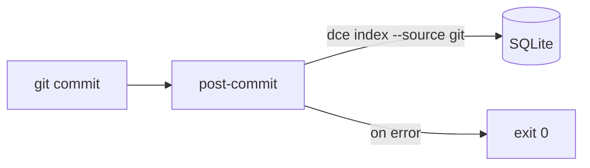

# Sprint 24 — Planejamento e entrega

**Sprint:** 24  
**Release alvo:** 1.8.0  
**Status:** ✅ Concluída (aguardando aprovação para Sprint 25)  
**Última atualização:** 2026-07-29

---

## Objetivo

Entregar **PB-092**: hook Git opcional `post-commit` que reindexa commits sem falhar o commit.

## Escopo

| ID | Item | Critérios de aceite | Status |
|----|------|---------------------|--------|
| PB-092 | `dce hooks install/uninstall/status` | Hook gerenciado; soft-fail; doctor check | ✅ |

### Fora de escopo

- Publish PyPI / tags (gated)
- Hooks além de post-commit
- Index full no hook (só `--source git`)

## Design

### Trade-offs

| Escolha | Motivo | Custo |
|---------|--------|-------|
| Só `git` indexer no hook | Rápido / alinhado ao evento | Outras fontes manuais |
| Soft-fail (`|| true`) | Não quebra workflow git | Index pode ficar stale |
| Marker `# dce-managed-hook` | Evita sobrescrever hooks alheios | Precisa `--force` |

## Entregas

| Item | Detalhe |
|------|---------|
| Version `1.8.0` | pyproject + `__version__` + CHANGELOG |
| `dce hooks *` | install / uninstall / status |
| Doctor | check `git_hook` informativo |

## Definition of Done

1. [x] Aceite PB-092  
2. [x] Testes + qualidade  
3. [x] Docs + CHANGELOG  
4. [x] Maintainer aprova encerramento / Sprint 25  

## Sprint 25

Entregue em `1.9.0` — ver [`Sprint25.md`](Sprint25.md).
