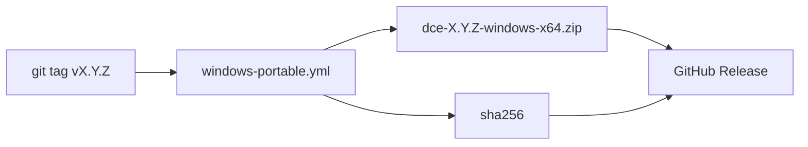

# Sprint 27 — Planejamento e entrega

**Sprint:** 27  
**Release alvo:** 1.11.0  
**Status:** ✅ Concluída (aguardando aprovação para Sprint 28)  
**Última atualização:** 2026-07-29

---

## Objetivo

Entregar **PB-095**: ao criar tag `v*`, o CI publica o ZIP Windows + checksum SHA-256 como **GitHub Release assets**.

## Escopo

| ID | Item | Critérios de aceite | Status |
|----|------|---------------------|--------|
| PB-095 | Release assets Windows | SHA-256; GHA Release na tag; docs | ✅ |

### Fora de escopo

- Assinatura Authenticode / SmartScreen
- MSI / Inno Setup
- Upload PyPI

## Design

## Entregas

| Item | Detalhe |
|------|---------|
| Version `1.11.0` | pyproject + `__version__` + CHANGELOG |
| Build script | emite `*.zip.sha256` |
| Workflow | `softprops/action-gh-release` em tags |
| Docs | [`ReleaseWindows.md`](ReleaseWindows.md) |

## Definition of Done

1. [x] Checksum no script PowerShell  
2. [x] Workflow publica Release em tags  
3. [x] Docs + version 1.11.0  
4. [ ] Maintainer aprova encerramento / Sprint 28  

## Sprint 28 (preview — não iniciar sem aprovação)

Candidatas: **init/git + tag real**, Authenticode, MSI/Inno, publish PyPI, ou `search_by_*`.
