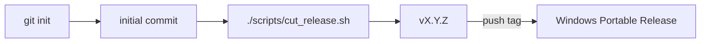

# Sprint 28 — Planejamento e entrega

**Sprint:** 28  
**Release alvo:** 1.12.0  
**Status:** ✅ Concluída (aguardando aprovação para Sprint 29)  
**Última atualização:** 2026-07-29

---

## Objetivo

**Bootstrap Git** do repositório DCE + script **`cut-release`** para tag SemVer alinhada à versão do pacote (libera o caminho Windows Release / PyPI).

## Escopo

| ID | Item | Critérios de aceite | Status |
|----|------|---------------------|--------|
| PB-096 | Git bootstrap + cut-release | `git init`; commit inicial; `scripts/cut_release.sh`; tag `v1.12.0` local | ✅ |

### Fora de escopo

- `git push` / remote (maintainer configura origin)
- Authenticode / MSI
- Upload PyPI (token)

## Design

## Entrega

| Artefato | Caminho |
|----------|---------|
| Cut-release | `scripts/cut_release.sh` |
| Docs | `docs/ReleaseGit.md`, este arquivo |
| Version | `1.12.0` |

## Definition of Done

1. [x] Repo git com commit inicial  
2. [x] Script cut-release  
3. [x] Tag local `v1.12.0`  
4. [x] Docs + testes; Maintainer aprova Sprint 29  

## Sprint 29 (preview)

Candidatos:

- Configurar `origin` + push da tag (Release Windows real)
- Publish PyPI (`PYPI_TOKEN`)
- Authenticode / MSI (se houver certificado)
- `search_by_*` aliases (só com evidência de uso)
