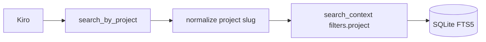

# Sprint 29 — Planejamento e entrega

**Sprint:** 29  
**Release alvo:** 1.13.0  
**Status:** ✅ Concluída (aguardando aprovação para Sprint 30)  
**Última atualização:** 2026-07-29

---

## Objetivo

Entregar **PB-071**: tool MCP aditiva `search_by_project` (alias tipado sobre `search_context` com filtro `project`).

## Escopo

| ID | Item | Critérios de aceite | Status |
|----|------|---------------------|--------|
| PB-071 | `search_by_project` | Tool estável; contract test; docs MCP; `schema_version` permanece `"1"` | ✅ |

### Fora de escopo

- PB-072–074 (component/technology/tag) — sprints seguintes
- Push remoto / PyPI / Authenticode

## Design

## Entrega

| Artefato | Caminho |
|----------|---------|
| Tool | `src/dce/interfaces/mcp/server.py` (`search_by_project`) |
| Contract | `STABLE_TOOLS` + `tests/contract/test_mcp_tools.py` |
| Docs | `docs/MCP.md`, este arquivo |
| Version | `1.13.0` |

## Definition of Done

1. [x] Tool + STABLE_TOOLS  
2. [x] Contract/unit tests  
3. [x] Docs + version 1.13.0  
4. [x] Tag local; Maintainer aprova Sprint 30  

## Sprint 30 (preview)

Candidatos:

- PB-072 `search_by_component`
- Push `origin` + tag (Release Windows real)
- Publish PyPI (`PYPI_TOKEN`)
