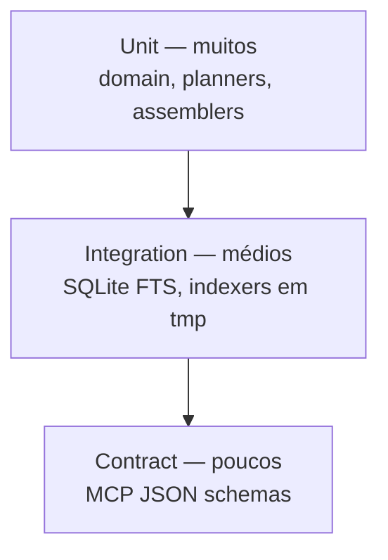

# Testing Strategy — Dev Context Engine (DCE)

**Última atualização:** 2026-07-29  
**Meta de cobertura:** ≥ **80%** nas camadas core (`domain`, `application`, `infrastructure/storage`)

---

## 1. Filosofia

Testar **comportamento observável** alinhado ao valor do produto: indexar corretamente, recuperar com FTS, montar `ContextPackage` dentro do budget, expor contratos MCP estáveis.

Não perseguir 100% de cobertura de linhas se isso gerar testes frágeis.

---

## 2. Pirâmide



| Camada | O que prova | Ferramenta |
|--------|-------------|------------|
| Unit | Regras de budget, ranking, parse frontmatter, planners | pytest |
| Integration | Repository + FTS + migrations + indexer→DB | pytest + tmp_path |
| Contract | Tools MCP input/output estáveis | pytest + golden files / jsonschema |
| Manual / exploratory | UX Kiro real | Checklist pós-0.2.0 |

**Sem** testes E2E com Jira cloud no CI (viola offline e flaky).

---

## 3. Organização

```text
tests/
  unit/
  integration/
  contract/
```

Espelhar pacotes quando ajudar (`tests/unit/domain/...`).

---

## 4. O que deve ser testado por componente

### Domain
- Validação de modelos
- Trim de budget (corta docs/chars previsivelmente)
- Dedupe / ordenação pura (se no domain)

### Application
- `BuildContext` com **FakeDocumentRepository**
- Planos do `RetrievalPlanner` para queries âncora vs livres

### Storage
- Migration sobe schema limpo
- upsert idempotente
- FTS encontra termo em title/body
- Filtros project/component/tag
- `list_recent` ordenação

### Indexers
- Fixtures de arquivos mínimos → `Document` esperado
- Ignora binários / paths fora do root

### MCP
- Cada tool: request válido → shape esperado
- Erro de documento inexistente → código estável

---

## 5. Cobertura

- Medir com `pytest-cov` (quando introduzido na Sprint 1).
- Gate: **80%** em core; falha de CI se cair sem justificativa.
- Excluir: `interfaces/*/main` finos de bootstrap se necessário (declarar em config).

---

## 6. Dados de teste

- Fixtures versionadas em `tests/fixtures/` (a criar na implementação)
- Nomes estáveis: `ORA-12541`, `PROJ-1`, ADR sample
- Nunca credenciais reais

---

## 7. Performance / regressão

- A partir de 0.6 / 1.0: benchmark opcional com índice sintético N docs
- Não bloquear PRs cedo com microbenchmarks instáveis
- Registrar baselines em docs quando existirem

---

## 8. Qualidade estática como “teste”

- `ruff check` + `ruff format --check`
- `mypy` no pacote `dce`
- Ambos no CI

---

## 9. Definition of Done (teste)

Um item só está pronto se:

1. Há teste automatizado do comportamento novo ou alterado  
2. Casos de borda relevantes cobertos (budget=0, query vazia, DB vazio)  
3. Não depende de rede  

---

## 10. Riscos de teste e mitigações

| Risco | Mitigação |
|-------|-----------|
| Testes acoplados a SQL interno | Assertar via API do repositório |
| Goldens MCP frágeis demais | Validar schema + campos-chave, não whitespace |
| FTS diferenças por plataforma | Usar tokenizer documentado; CI multi-OS na 1.0 |
