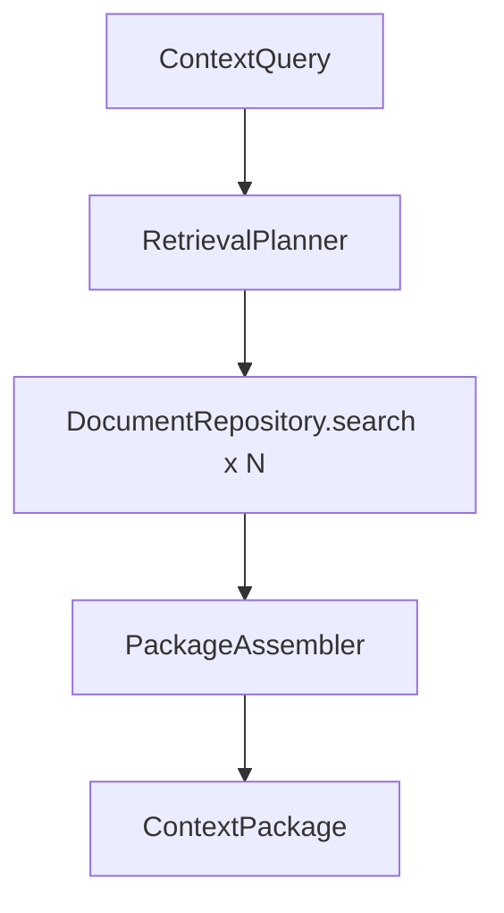

# ADR-002 — Context Builder como núcleo do produto

- **Status:** Accepted
- **Data:** 2026-07-29
- **Decisores:** Maintainer / Lead Architect (DCE)
- **Tags:** product, application, retrieval

---

## Contexto

O briefing lista várias ferramentas de busca (`search_*`) e várias fontes. Sem uma decisão de produto, o DCE corre o risco de virar “mais um search wrapper” ou um clone de memória de notas — ambos explicitamente rejeitados na visão.

O consumidor (Kiro) precisa de um **pacote de contexto** para agir, não de uma lista crua de hits.

## Decisão

1. O **Context Builder** é o componente principal do sistema.
2. Busca/indexação são **primitivas** a serviço do Builder.
3. A operação de produto primária é `build_context` → `ContextPackage` estruturado.
4. `search_memory` e demais buscas tipadas são **secundárias** (filtros/aliases), não um produto paralelo.
5. Todo pacote respeita um **`ContextBudget`** explícito.

## Alternativas consideradas

| Alternativa | Prós | Contras | Por que não |
|-------------|------|---------|-------------|
| Search-first API | Simples de implementar | Empurra montagem de contexto para o Kiro (inconsistente) | Valor fica fora do DCE |
| Memory-first (ai-memory style) | DX de notas | Ignora Jira/Git/ADR corporativos | Fora da visão |
| Sempre union de todas as fontes | Completo na teoria | Lento, ruidoso, caro em tokens | Planner + quotas |
| Resposta em prosa Markdown livre | Fácil de ler humano | Ruim para agente estruturado | MCP tipado |

## Consequências

### Positivas

- Norte claro para backlog e sprints
- Kiro recebe objeto consumível e estável
- Indexers permanecem plugáveis sem alterar o núcleo
- Diagnostics no pacote aumentam confiança e debuggabilidade

### Negativas / trade-offs

- Builder é mais complexo que um `MATCH` único
- Exige design de seções/ranking cedo
- Risco de over-engineering do planner

### Mitigações

- Planner v1 baseado em regras + config
- Sprint slicing: store → indexer → builder → MCP
- Testes com fake repository antes de FTS real no builder

## Conformidade

Features que adicionem “busca” sem caminho claro para o Builder devem ser questionadas no review.
