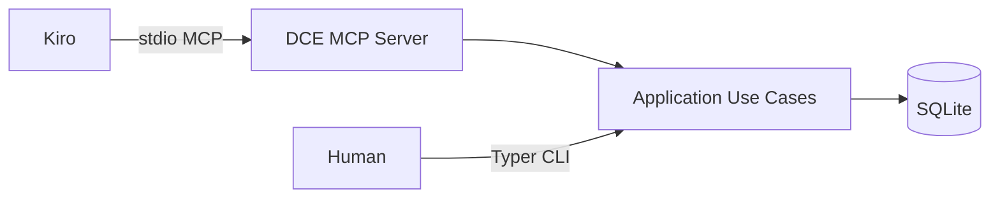

# ADR-003 — Interface MCP-first otimizada para Kiro

- **Status:** Accepted
- **Data:** 2026-07-29
- **Decisores:** Maintainer / Lead Architect (DCE)
- **Tags:** mcp, interface, kiro, dx

---

## Contexto

O DCE é desenvolvido no Cursor, mas o **consumidor principal de runtime é o Kiro**, que consultará o motor continuamente. A interface precisa ser rápida, consistente e estruturada.

Uma CLI rica é necessária para operação humana (index, doctor), porém não pode ditar o contrato do agente.

Há também risco de expor cedo demais dezenas de tools `search_by_*`, aumentando carga cognitiva do agente e custo de versionamento.

## Decisão

1. **MCP (stdio)** é a interface primária para o Kiro.
2. Respostas MCP são **objetos estruturados** (Pydantic → JSON), não prosa.
3. CLI Typer é interface **operacional/secundária**, reutilizando os mesmos use cases.
4. Superfície MCP inicial mínima: `build_context`, `search_context`, `get_document`, `recent_documents`.
5. Tools `search_by_*` e `search_memory` entram só com evidência de necessidade (aliases sobre filtros).
6. Contratos cobertos por **contract tests** e `schema_version`.

## Alternativas consideradas

| Alternativa | Prós | Contras | Por que não |
|-------------|------|---------|-------------|
| Só CLI + o agente parseia stdout | Simples | Frágil; sem schema | Pior DX para Kiro |
| HTTP REST local | Familiar | Mais moving parts; auth desnecessária | stdio MCP encaixa no agente |
| Muitas tools no dia 1 | Espelha briefing | Overhead de escolha no agente | Consolidar filtros |
| Respostas em texto livre | Rápido de hackear | Parsing inconsistente | Viola requisito estruturado |
| gRPC | Tipado | Ecossistema agente/MCP menos natural | Fora do padrão do consumidor |

## Consequências

### Positivas

- Otimização explícita para o consumidor real
- Use cases únicos (CLI e MCP não divergem regra)
- Evolução controlada via SemVer + contract tests
- Menos tools → maior taxa de uso correto de `build_context`

### Negativas / trade-offs

- MCP adiciona dependência (FastMCP/SDK) e disciplina de schema
- Aliases atrasados podem frustrar quem leu o briefing literal
- stdio implica processo por sessão IDE (aceitável)

### Mitigações

- Documentar filtros equivalentes no README de integração Kiro
- Introduzir aliases quando telemetria qualitativa (uso real) pedir
- Escolher lib MCP na sprint E4 com POC de schemas Pydantic

## Conformidade

Nenhuma tool MCP nova sem: modelo de resposta tipado, teste de contrato, entrada no CHANGELOG/Versioning.
