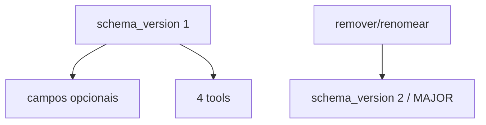

# ADR-004 — Estabilidade do contrato MCP schema_version 1

- **Status:** Accepted
- **Data:** 2026-07-29
- **Decisores:** Maintainer / Lead Architect (DCE)
- **Tags:** mcp, versioning, kiro, compatibility

---

## Contexto

O Kiro consome o DCE via MCP stdio. Após sprints 04–09 o conjunto de tools e o
`ContextPackage` estabilizaram o suficiente para documentar regras explícitas de
compatibilidade — sem ainda declarar SemVer `1.0.0` (faltam packaging/SLOs).

Sem regras claras, campos aditivos ou tools novas podem quebrar clientes silenciosamente
ou inflar a superfície cognitiva do agente.

## Decisão

1. **`schema_version: "1"`** é o contrato MCP vigente (payloads estruturados).
2. **Superfície de tools estável (1.0):**  
   `build_context`, `search_context`, `get_document`, `recent_documents`.  
   Em **1.1.0+** aliases tipados aditivos (ex.: `search_memory`, `search_by_issue`) entram com contract test + CHANGELOG, sem bump de `schema_version`.
3. **Aditivo-only** dentro de `schema_version` 1:
   - campos opcionais novos ok
   - remover/renomear campo ou tool → novo `schema_version` (ou MAJOR)
4. `build_context` permanece a tool primária; busca crua é primitiva.
5. Aliases `search_by_*` / `search_memory` só com evidência de uso (ADR-003).
6. Fonte de verdade em código: `dce.interfaces.mcp.contract`.
7. Documentação normativa: [`docs/MCP.md`](../MCP.md).

## Alternativas consideradas

| Alternativa | Prós | Contras | Por que não |
|-------------|------|---------|-------------|
| Declarar 1.0.0 agora | Clareza de marketing | Sem PyPI/SLOs/runbook | Roadmap ainda gated |
| Permitir breaking em 0.x sem schema bump | Velocidade | Quebra Kiro | Viola Versioning.md |
| Muitas tools já | Espelha briefing | Carga cognitiva | ADR-003 |

## Consequências

### Positivas

- Contract tests podem freezear a superfície
- Clientes Kiro sabem o que é estável vs experimental
- Evolução aditiva sem medo de patch

### Negativas / trade-offs

- Mudanças desejáveis podem exigir `schema_version` 2
- Docs e testes precisam acompanhar cada campo aditivo

### Mitigações

- Checklist em `docs/MCP.md` + DoD de sprint
- Contract tests cobrindo diagnostics e tools
