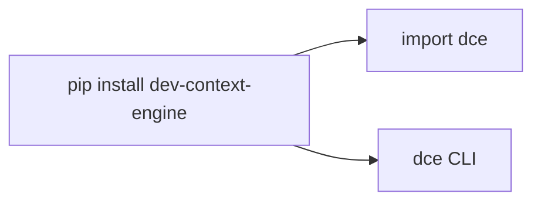

# ADR-005 — Nome de distribuição PyPI `dev-context-engine`

- **Status:** Accepted
- **Data:** 2026-07-29
- **Decisores:** Maintainer / Lead Architect (DCE)
- **Tags:** packaging, pypi, naming

---

## Contexto

O produto e a CLI se chamam **DCE** (`dce`). No PyPI, o nome de distribuição
`dce` já está registrado por outro projeto (placeholder BSO SDK, não relacionado).

Publicar sob `dce` exigiria transferir/disputar o nome — inviável e arriscado.

## Decisão

1. **Nome PyPI:** `dev-context-engine`
2. **Import Python:** `dce`
3. **Console script:** `dce`
4. Documentar a diferença em [`Packaging.md`](../Packaging.md) e README

## Alternativas consideradas

| Alternativa | Prós | Contras | Por que não |
|-------------|------|---------|-------------|
| Forçar nome `dce` | Branding curto | Nome ocupado | Bloqueia publish |
| `dce-engine` / `dce-kiro` | Curto | Menos descritivo; risco de colisão | Preferir nome descritivo livre |
| Namespace org | Claro | Requer org PyPI | Prematuro |

## Consequências

### Positivas

- Publicação possível imediatamente
- Identidade de runtime (`dce`) preservada

### Negativas / trade-offs

- `pip install` usa nome longo
- Docs precisam repetir o mapeamento

### Mitigações

- README e Packaging.md com exemplos explícitos
- Keywords PyPI incluem `dce`
