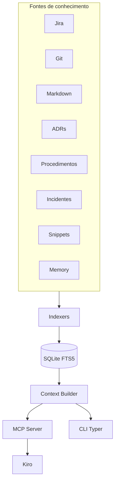
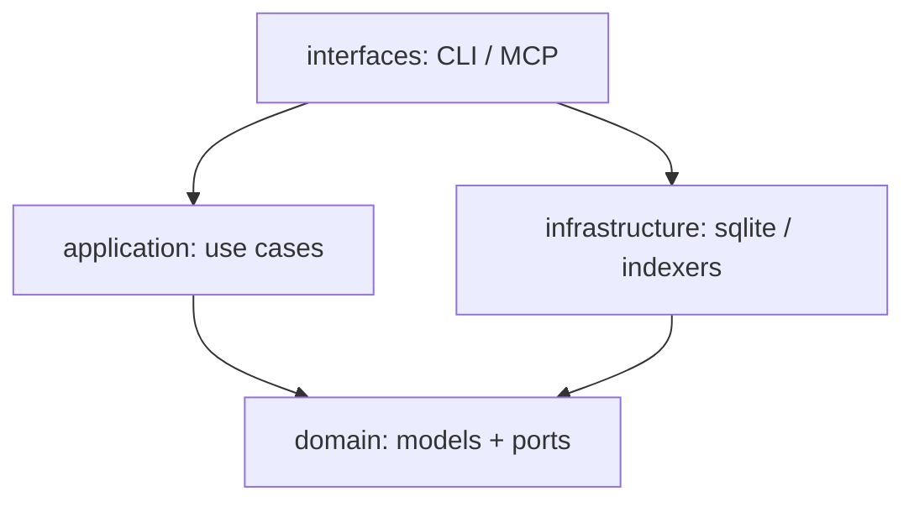
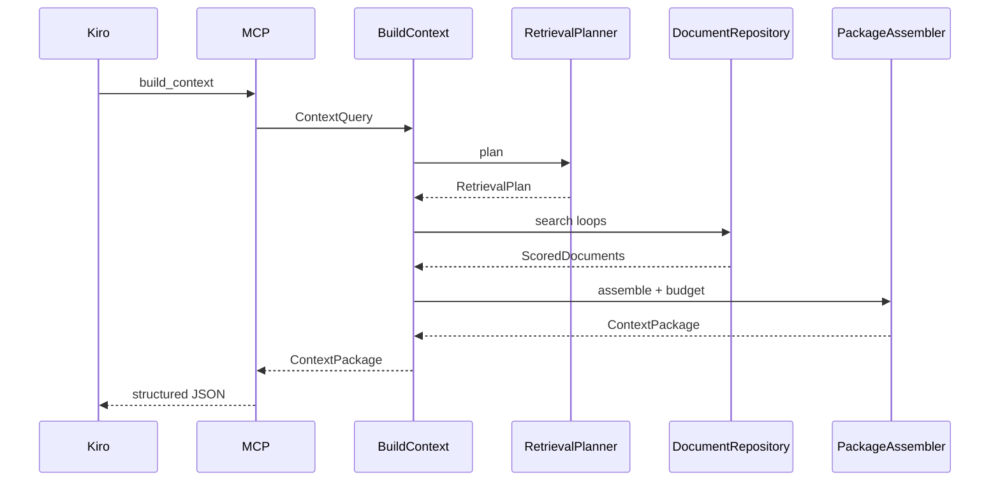
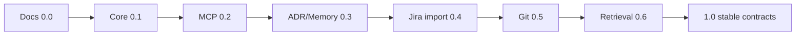

# Diagrams — Dev Context Engine (DCE)

Diagramas Mermaid de referência rápida. Fontes canônicas também estão embutidas nos docs principais.

## Contexto do sistema

## Clean Architecture (dependências)

## Fluxo build_context

## Roadmap simplificado

